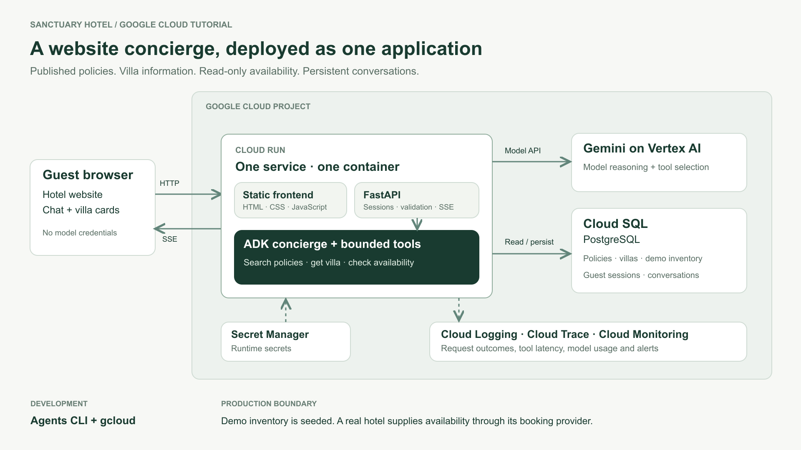

# How I Build Production AI Agents (Hotel Booking Agent)

Repository companion to the [script](https://docs.google.com/document/d/1iew1Q6D1TstNOhaNfR92Rjt5rQtfq4UBF7rP0c0UIB0/edit) and [Passage review copy](https://passage.md/d/UNCo0VxmJNyBqmHD0urd9g).

**Build status:** the hotel website is a runnable prototype with simulated chat. The agent, database and cloud deployment below are the planned tutorial build.

Alternative title: How I Ship Production AI Agents (Full Guide)

## Hook

This is a complete guide to building production AI agents.

Most tutorials show you how to build an agent on your laptop.

Almost nobody shows you what it takes to put one in front of real customers. That's what this video is about.

We're going to take one agent all the way from design to deployment. We'll build a customer support agent into a hotel website, deploy it on Google Cloud, and show you how to make it reliable for a real business.

By the end, you'll have the exact process I use to ship AI agents into production.

All the code, I'll link for free in the description below.

So let's get into it.

## Context

We’re going to be building an AI agent for a hotel.

Imagine a hotel client comes to you with a familiar problem. Their team spends a lot of time answering the same questions. What time is check-out? Is breakfast included? Which villa would work for two people next month?

They want guests to get useful answers quickly, including when the team is busy, and they want staff to spend less time handling repetitive enquiries.

One solution to this problem is to build AI agents to answer customer questions. Not only does this help the business save time and money, it also provides a much better experience for guests.

I found a related holiday concierge project on Upwork with an advertised budget of $4,750. That one was for WhatsApp; we're building a hotel website version. I'll share the code for free.

Reference: [Holiday Concierge Chat Bot](https://www.upwork.com/freelance-jobs/apply/Holiday-Concierge-Chat-Bot_~022092567151788852206/). This is an advertised budget, not a completed contract. Running the application can incur cloud and model charges.

## Video scope

Target: 30 minutes. One fictional hotel, with policy answers and read-only villa availability.

Cloud Run, ADK, Gemini through Vertex AI and PostgreSQL. No payments, reservation changes, WhatsApp or background queue.

## Architecture

See the [full design](docs/Architecture.md) for tool contracts, sessions and failure handling.

- One Cloud Run service serves the static frontend, FastAPI API and ADK agent. Keep frontend/ and backend/ as separate source folders.

- Gemini through Vertex AI selects tools: search policies, get villa details and check availability.

- Cloud SQL for PostgreSQL stores policies, villas, demo inventory and conversations. Availability is calculated by database logic.

- Stream answers over HTTP using SSE. No queue or WebSocket is needed for this chat flow.

- Keep credentials on the server; enforce session ownership, request limits and safe retries.

## Plan the build

- Break the implementation into tasks for Codex, with a working result and a check for each.

- Build in order: local setup → website → agent and database tools → tests → deployment → monitoring.

- Use Agents CLI skills during development; inspect and verify generated code.

## Set up Google Cloud

Use the paste-ready prompts in the [setup guide](resources/setup-guide.md).

- Install and check Python, uv, Node, gcloud and Agents CLI.

- Reuse `personal-infrastructure-505708`, verify billing, choose the application/model locations and set a budget alert. Preserve other workloads. Explain that separate client projects improve cost tracking; this demo uses a shared project.

- Configure local Application Default Credentials, enable the model API and verify Gemini access.

- Explain local developer credentials versus the service identity used on Cloud Run.

## Build the frontend

- Use the Sanctuary Hotel website and generated photography.

- Add the chat widget, streamed answers, policy source links and villa cards.

- Handle loading, unavailable data, retries and expired sessions; check mobile layout.

## Build the ADK agent

- Define the concierge instructions and three read-only tools.

- Use Gemini through Vertex AI; show the model choosing and calling a tool.

- Connect the ADK runner to FastAPI and stream structured events to the widget.

- Ask for missing dates; return an honest fallback when information is unavailable.

## Run locally and evaluate

- Start Postgres, apply migrations and seed fictional policies, villas and occupancy.

- Demonstrate available villas, a fully booked stay and a question needing clarification.

- Verify conversation history survives an API restart and stays private to its browser session.

- Test availability boundaries, missing policies, failed tools, prompt injection and duplicate requests.

- Run a fixed evaluation dataset, review answers against evidence, fix a failing case and rerun. Compare manual verdicts with an optional LLM judge.

## Deploy to Google Cloud

- Package the frontend and backend into one container and store it in Artifact Registry.

- Set up Cloud SQL, a scoped service identity and Secret Manager; run migrations.

- Deploy to Cloud Run with request timeouts, instance limits, rate limits and bounded database connections.

- Repeat the guest journey on the cloud URL; verify SSE, source links and persistent history.

- Show revision rollback and explain model quotas, costs and resource cleanup.

## Observability and alerts

- Show request logs, response latency, errors, tool timings and model usage.

- Trace a deliberately failed availability lookup in Cloud Trace, including the guest-facing fallback.

- Remove the fault and repeat the request to verify recovery.

- Add an alert for repeated failures and test its notification channel.

- Keep guest content out of logs. Explain billing alerts and application usage limits.

## Wrap up

- Repeat the deployed guest journey: policy answer, available villas and saved conversation.

- Explain how a real hotel would connect the availability tool to its booking provider.

- Share the code, architecture and setup guide. Thank Google Cloud.

## Appendix: services and tools shown

Google Cloud services and development tools demonstrated in the video.

| Service / tool | Role in the system | What viewers will see |
| --- | --- | --- |
| Cloud Run | Application and agent runtime | Container deployment, revision, limits and streamed chat. |
| Cloud SQL for PostgreSQL | Durable application data | Policies, villas, demo occupancy and persistent conversations. |
| Vertex AI + Gemini | Model access | Authenticated model call, tool selection and model configuration. |
| Secret Manager | Runtime secrets | Secret reference in deployment; no credentials in the frontend. |
| IAM + service accounts | Runtime permissions | Dedicated service identity with scoped model and database access. |
| Cloud Logging | Operational events | Correlated request IDs and safe error records. |
| Cloud Trace | Request investigation | API, model and tool spans for a failed availability lookup. |
| Cloud Monitoring | Metrics and alerts | Latency/error chart, alert policy and notification test. |
| Cloud Billing | Project cost visibility | Project billing, budget alert and distinction from a hard spend cap. |
| Artifact Registry | Container image storage | Image tag/digest used by a Cloud Run revision. |
| Google ADK (framework) | Agent implementation | Agent instructions, typed tools, runner and session integration. |
| Agents CLI (developer tool) | Build workflow support | Installed coding-assistant skills, starter inspection and evaluation workflow. |
| gcloud (developer tool) | Cloud configuration | Project setup, local credentials and deployment commands. |
