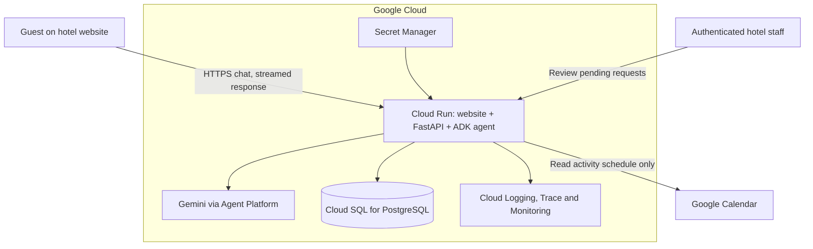
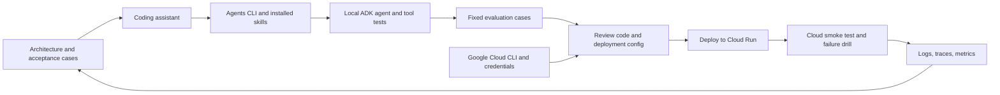

# Build and Deploy an AI Hotel Support Agent on Google Cloud

Working draft: scripted opening and a 30-minute video outline. The application
backend and cloud demonstrations described below are planned. The saved website
prototype is runnable, with simulated concierge responses.

## Opening Script

Today I'm going to show you how to build and deploy an AI hotel support agent on Google Cloud. Getting an agent to answer a question locally is a useful start, but what happens when a guest asks something it can't answer, or one of its tools stops working? We're building this hotel website with an assistant that can search the guest guide, check activities, and pass requests to the host. Then we'll deploy it, test its answers, and investigate a failure using logs and traces. This video is sponsored by Google Cloud, and I'll share the code and resources below so you can adapt it to your own projects. So, let's get into it.

## Before We Build

The example is Sanctuary Hotel, a fictional resort with a website and an embedded
Ask AI widget. The intended audience is developers and freelancers who can build
a web application and want to understand how to deploy and operate an agent.

Guests repeatedly ask about check-in, breakfast, transport, and activities.
The assistant should answer questions from the hotel's published information,
look up the current activity schedule, and record requests that need a person.
The proposed business benefit is fewer repetitive questions for staff and a
clearer handoff when a guest needs help. We need real usage to measure that benefit.

The website makes the outcome easy to see. Most of the video focuses on the
agent and what it takes to run it reliably. Use original, generated photography
for this fictional property, clearly identified as illustrative demo imagery.

### The guest journey

1. A guest asks, "What time is breakfast?" The assistant searches the guest guide
   and answers with a link to the relevant section.
2. They ask, "What activities are on tomorrow?" The assistant checks the resort's
   Google Calendar, using the resort's time zone.
3. They ask, "Can I arrange a late checkout?" The assistant explains the policy,
   asks for the missing details, and offers to send a request to the host.
4. After the guest confirms, the app saves a request and shows its reference.
   It says the request is pending, not that late checkout is approved.

Use fictional guest data and a dedicated demo calendar. Do not connect this
public demonstration to a real guest directory or reservations system.

## Start with the saved website

The Sanctuary Hotel design is preserved in [code/website/](./code/website/), including
all three generated images. Follow the [preview instructions](./code/README.md)
to run it locally. The [setup guide](./resources/setup-guide.md) covers Google
Cloud CLI, credentials, Agents CLI, and the ordered build workflow. The diagrams
below describe the proposed backend, not the current scripted mockup.

## Proposed Architecture

The initial deployment design uses one Cloud Run service for the website,
Python API, and ADK agent. PostgreSQL holds guest-guide sections, conversations,
and host requests. Gemini supplies model responses through Google Cloud.



Cloud Run is the proposed application and agent runtime here. Accessing Gemini
through Gemini Enterprise Agent Platform does not mean the agent itself runs in
its managed Agent Runtime. Settle the deployment target before implementing the
cloud setup; this outline does not claim both deployment paths are demonstrated.

Google documents [ADK deployment to Cloud Run](https://adk.dev/deploy/cloud-run/).
This diagram is our proposed application design, not a verified implementation.

### How we build and deliver the system



Agents CLI helps the coding assistant build and operate the agent. It is a
**development tool**, not a service sitting between the guest and Gemini.

### One guest question

```mermaid
sequenceDiagram
    participant Guest as Guest widget
    participant API as Cloud Run API
    participant Agent as ADK agent + Gemini
    participant Tool as Guide or calendar tool
    participant DB as PostgreSQL
    Guest->>API: Question and session cookie
    API->>DB: Verify session ownership; load history
    API->>Agent: Question and scoped context
    Agent->>Tool: Bounded lookup
    alt Lookup succeeds
        Tool-->>Agent: Evidence and source
        Agent-->>API: Answer grounded in evidence
    else Lookup unavailable
        Tool-->>Agent: Explicit unavailable result
        Agent-->>API: Honest fallback; offer host request
    end
    API->>DB: Save conversation events
    API-->>Guest: Stream answer and source links
```

The service can stream partial output during a turn; the diagram groups the
messages for clarity. Persist completed turns and useful failure events without
logging private guest content by default. No queue is required for this flow.

### A confirmed request to the host

```mermaid
sequenceDiagram
    participant Guest as Guest widget
    participant API as Application API
    participant DB as PostgreSQL
    participant Staff as Staff request list
    API-->>Guest: Proposed request and server-issued action ID
    Guest->>API: Confirm action ID
    API->>API: Verify session and confirmation
    API->>DB: Insert pending request with unique action ID
    alt First submission
        DB-->>API: New request reference
    else Retry after a lost response
        DB-->>API: Existing request reference
    end
    API-->>Guest: Pending; not a confirmed booking
    Staff->>API: Authenticated request-list read
    API->>DB: Load pending requests
    DB-->>API: Pending requests
    API-->>Staff: Display work to follow up
```

The current prototype only shows a simulated reference. In the implemented
version, this write must be durable before the UI claims it was received.

### Three narrow tools

| Tool | Source or action | Boundary |
| --- | --- | --- |
| `search_guest_guide(query)` | Search published guide sections in PostgreSQL and return source links. | Parameterized queries and bounded results. No arbitrary model-written SQL. |
| `get_activities(date)` | Read events from one configured resort calendar. | Read-only, resort time zone, explicit unavailable result on failure. |
| `create_host_request(summary)` | Save a pending request and return its reference. | Require guest confirmation; attach the session on the server; deduplicate retries. |

Start with PostgreSQL full-text search for this small guide. Evaluate paraphrased
questions before deciding whether embeddings improve retrieval enough to add
another component. Keep searchable policy text separate from conversation history.

The model chooses tools and composes the answer. Application code owns access
checks, input validation, confirmation, and database writes. A prompt is not an
authorization boundary.

### Interactive requests and state

Chat uses an async request handler and a streamed response. A queue is not needed
for this initial interactive flow. Async I/O allows other requests to make
progress while a model or calendar request is waiting; it does not remove resource
limits or make work durable after the request ends.

Store conversation state outside Cloud Run instances. Give each browser a
server-issued session, enforce ownership on every history read, and serialize
turns within one conversation. A session identifies a conversation, not a verified
hotel guest. V1 must not reveal bookings, room access codes, or other private data.
Host requests can include guest-supplied contact details with consent, but staff
must verify identity before acting on a reservation.

For host requests, use a server-issued action identifier bound to the confirmed
request and a database uniqueness constraint. If the connection drops after a
successful write, retrying returns the same reference. Staff can view persisted
requests in a small authenticated list. Email or push notifications can later use
a durable background delivery mechanism; they are outside this first build.

## Video Outline

Target: approximately 30 minutes, including the opening. The website is prepared
before the recording so styling does not consume the agent tutorial. Show real
results once implemented; do not substitute the scripted UI prototype for a live
agent response.

### 0:00–2:30 | Show the finished experience and the problem

**On screen:** hotel website, the three guest interactions, and a saved pending
request visible to staff.

Deliver the opening and sponsorship disclosure. Explain the support workload,
the assistant's job, and the boundary between answering and approving requests.

Personal context, adapted from the original proposal:

> When I started freelancing, I needed somewhere to deploy the applications I was building for clients. I wanted a setup I could understand and reuse across projects. Google Cloud became that platform for me. For this project we're using Cloud Run to host the application and PostgreSQL to store its data. I'll show you how those pieces fit around the agent.

Keep claims about billing precise: separate client projects and billing
arrangements need deliberate setup; they do not happen automatically.

### 2:30–5:00 | Design the system and define success

**On screen:** architecture diagram, tool table, and example guest questions.

Explain the browser-to-API-to-agent flow and what each tool is allowed to do.
Distinguish published facts, live schedule data, and requests that require staff.
Show where conversations and requests persist. Explain why interactive streaming
is enough here and when background work would need a different execution path.

Write the first expected outcomes before building. The success criterion is a
correct answer or a useful handoff, not merely a fluent response.

### 5:00–11:00 | Build and test the agent locally

**On screen:** coding assistant in the editor, its use of Agents CLI, generated
ADK Python code, tool tests, and local conversations.

Use the coding assistant with Agents CLI to scaffold the agent and its evaluation
setup. Use Google Cloud CLI for cloud configuration through the coding workflow.
Explain the generated files and important tool calls; verify exact commands
against the installed versions before recording.

Seed fictional guest-guide content in local PostgreSQL. Implement the three
tools, then inspect their inputs and results before relying on model responses.
Connect a dedicated Google Calendar containing fictional resort activities.

Demonstrate one answer, one clarification, and one unavailable-data response.
Keep secrets out of prompts, browser code, source control, and screen recordings.

### 11:00–14:00 | Connect the website and save state

**On screen:** Ask AI widget receiving streamed output, sources, a confirmation
step, and an authenticated staff request list.

Connect the prepared UI to the Python API. Add visible loading and failure states,
source links, and a host-request confirmation. Reload the page and recover the
conversation. Submit the same confirmed request twice and show one saved record.

Explain session ownership and why private booking information is excluded.
Render model text safely and validate source links before displaying them.

### 14:00–20:00 | Deploy the application on Google Cloud

**On screen:** coding assistant configuring cloud resources, deployment results,
and the same guest journey against the cloud URL.

Create the Cloud SQL database, apply migrations, and seed the fictional guide.
Configure the service identity, narrowly scoped permissions, and Secret Manager
for credentials that cannot use workload identity. Keep model access on the server.
Deploy the website, API, and agent to Cloud Run using the chosen build workflow.

Separate public guest routes from staff-only access. Add request-size limits,
rate limits, tool timeouts, and bounded model/tool steps. Explain the relationship
between Cloud Run concurrency, maximum instances, model quotas, and database
connection pools. Do not claim a user capacity without a measured load test.

Verify that conversation history and host requests survive a new application
instance. Explain model usage and infrastructure costs separately, including the
database's ongoing cost. Set a budget alert and explain that it is not a hard
spending cap. Include resource cleanup in the eventual runnable instructions.

### 20:00–24:00 | Investigate a failure

**On screen:** a clearly labelled calendar timeout, the guest-facing fallback,
a request trace, related logs, and a metric/alert configuration.

Introduce a controlled delay in the calendar tool. Show that the assistant says
it cannot check the schedule, rather than inventing activities. Follow the same
request through instrumented spans for the API, agent, and tool in Cloud Trace.
Inspect correlated logs without exposing guest messages or contact details.

Remove the fault and compare measured timings. Track errors, latency, model token
usage, and handoff counts. Add one actionable alert for sustained tool failures.
Use "Cloud Trace" or "observability tooling" for the monitoring discussion.

### 24:00–29:00 | Evaluate answer quality and improve it

**On screen:** a repeatable dataset, expected behavior, actual tool calls and
answers, manual verdicts, and a rerun after a fix.

Run the cases below against fixed guide/calendar fixtures. Check facts and tool
outcomes in code where possible. Review answers manually, then use an LLM judge
with the relevant evidence and expected behavior. Compare its judgments with
manual verdicts; do not treat the judge as ground truth.

Show a real failing case from implementation, diagnose whether retrieval, tool
behavior, or instructions caused it, and rerun the same dataset after the fix.
If no real failure is available, label a deliberately weakened baseline as a
controlled example. Report latency and token use alongside answer quality.

### 29:00–30:00 | Repeat the journey and share the project

**On screen:** deployed hotel site, cited answer, pending request, and repository.

Show the complete guest journey again. Explain how to replace the fictional
property information and calendar for another business. State what still needs
work before a real launch: identity integration for private data, measured load
capacity, data retention, and the hotel's staff response process.

Closing talk track:

> We've now taken a guest question all the way through the system: finding the right information, checking a live schedule, and saving a request for a person when the agent can't finish the job. We've also seen how to deploy it, investigate a failure, and test whether its answers are actually useful. The code and setup instructions are linked below, so you can use this as a starting point for your own application.

Use that closing only once the build and checks actually support those claims.

## Evaluation Cases

These are planned acceptance cases, not reported test results.

| Case | Expected behavior |
| --- | --- |
| Breakfast hours | Answer using the seeded guide and cite the supporting section. |
| Paraphrased breakfast question | Retrieve the same policy without requiring exact wording. |
| Tomorrow's activities | Query the correct date in the resort time zone and use returned events. |
| Empty calendar | Say no activities are listed for that date; do not infer a tool failure. |
| Calendar timeout | Explain the schedule is unavailable; do not invent events. |
| Late checkout | Explain policy, collect missing details, request confirmation before writing. |
| Retried confirmed request | Return the original reference; create exactly one pending request. |
| Missing policy | Acknowledge the information is unavailable and offer a host request. |
| Request for another guest's booking | Refuse private-data access; do not query another guest's records. |
| Instructions hidden in retrieved text | Treat retrieved text as evidence, not authority to change tool permissions. |
| Off-topic request | Redirect to the hotel's support scope. |
| Refresh or another application instance | Recover only the current session's persisted conversation. |

## Scope of the First Version

Include the hotel website, one ADK agent, the three tools, persistent sessions,
a small staff request list, cloud deployment, evaluations, and request tracing.

Exclude payments, booking changes, WhatsApp broadcasts, multiple hotels,
long-term guest preference memory, and a custom analytics dashboard. Use existing
Google Cloud views and a readable evaluation report for the operating demo.

The project should prove one complete support workflow before adding more tools.
A useful next exercise is to add a hotel policy, write a failing evaluation case
for it, then improve retrieval until the answer is supported by the source.
