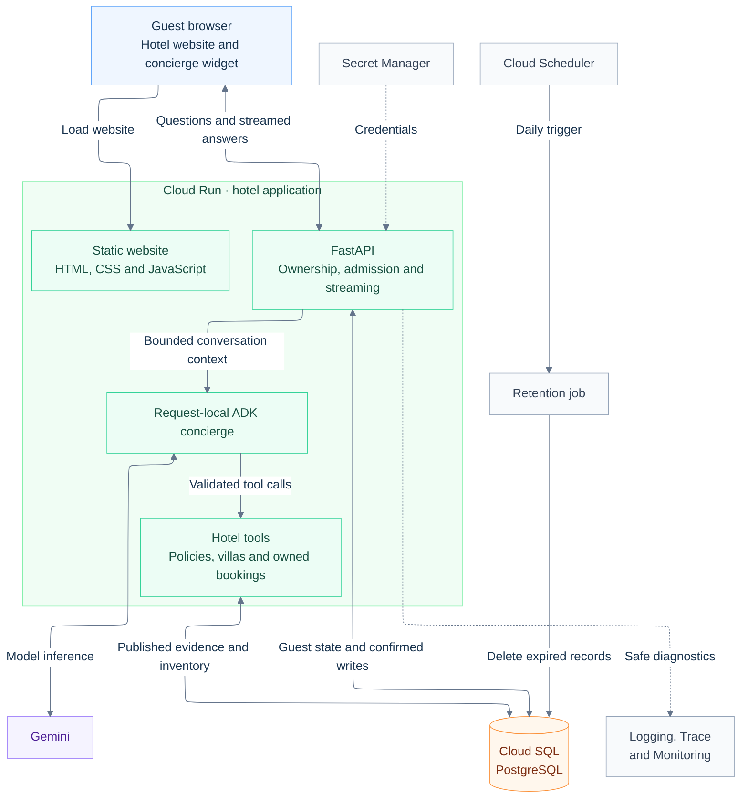
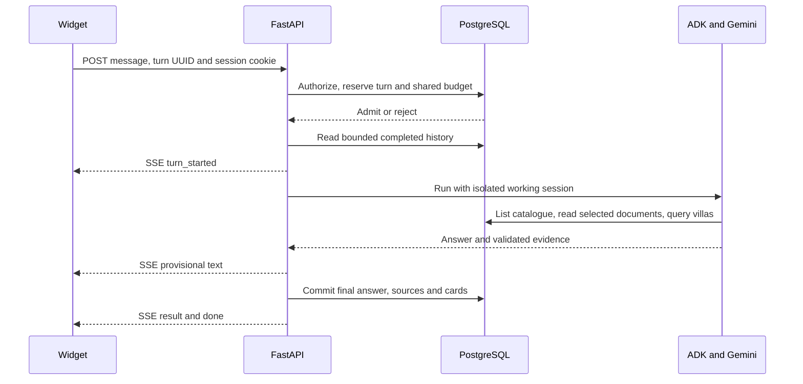

# Sanctuary Hotel: architecture

This document describes the intended system for the [Sanctuary Hotel requirements](Requirements.md). It defines component responsibilities, data ownership, runtime behavior, and the rules that implementations must preserve. Deployment and capacity targets require the verification described below.

## Design overview

One Cloud Run service serves the existing website and a FastAPI API. Each admitted guest turn runs an isolated Google ADK concierge that uses Gemini and bounded hotel tools. PostgreSQL owns published hotel evidence, inventory, reservations, guest conversations, and shared admission state.

This design keeps the first system small while supporting multiple service instances. The model interprets questions and explains tool results. Application code owns authorization, availability, persistence, and all confirmed writes.

| Component | Responsibility |
| --- | --- |
| Browser | Present the website, stream provisional answers, recover saved results, and collect explicit confirmations. |
| FastAPI application | Authenticate the guest session, enforce ownership and limits, coordinate turns, and validate responses. |
| ADK adapter | Build request-local model context, expose approved tools, and return answer text with validated evidence. |
| Hotel queries and tools | Read published policies, compute availability, look up owned reservations, and prepare bounded request drafts. |
| PostgreSQL | Enforce durable ownership, turn idempotency, reservation consistency, and shared budgets. |
| Gemini | Select tools and produce explanations within the supplied evidence and limits. |
| Maintenance job | Delete expired conversation data and rate counters on a daily schedule. |

## System boundary




The browser communicates only with the application. The diagram separates guest access, model inference, and durable storage; retention runs outside the request path. The application uses Gemini for inference and PostgreSQL for durable state. Secret Manager supplies runtime credentials; monitoring receives safe diagnostics. A scheduled job handles retention independently of guest requests.

## Source layout

```text
frontend/                 static hotel site, assets and browser modules
  js/                     site, chat, API/SSE and safe rendering
backend/
  app/                    API, settings, sessions, turns, agent, tools and hotel queries
  migrations/             ordered SQL migrations with a transactional version ledger
  seeds/                  importer for hotel/ source files; no duplicate content
  tests/                  agent contracts and real PostgreSQL integration tests
  pyproject.toml
  uv.lock
infra/                    repeatable provisioning, release and maintenance commands
hotel/                    reviewed fictional policies, villas and nightly inventory
evals/                    fixed guest questions and expected facts
scripts/                  local run and verification commands
docs/                     requirements and architecture
compose.yaml              local PostgreSQL
Dockerfile                one image containing frontend and backend
```

This layout describes the intended organization. Use plain browser JavaScript and Python async I/O. Routes call application modules; tools delegate to hotel queries. Keep ADK types inside the agent adapter so API and persistence code do not depend on model-framework objects. Introduce subfolders or abstractions when they solve a demonstrated need.

## Guest turn flow



The widget uses POST plus `fetch()` streaming. SSE carries progressive output; JSON endpoints load history and turn status. No chat queue or WebSocket is required. A request waits asynchronously on model/network I/O while other guests progress.

PostgreSQL is the sole durable conversation record. Each invocation creates isolated ADK working state from completed turns, then disposes of it. No shared mutable agent history and no second persistent ADK history store. Later requests may reach any instance without sticky sessions.

## Data ownership and lifecycle

| Entity | Ownership and consistency rule |
| --- | --- |
| Guest session | Identified by a random cookie token. Authentication expires after 24 hours; retention deletes the session and its conversations after 30 days. |
| Conversation | Belongs to one guest session. At most one turn may be active. Starting a new conversation atomically changes the active ID, clears visible and model context, and preserves earlier records for retention. Reject a reset while a turn is active. |
| Turn attempt | Identified by a client UUID. Stores status, deadline, input, final answer, sources, cards, safe error, and usage. A completed result is immutable. |
| Published document version | Stores document ID, revision, title, summary, keywords, and complete body. Citations identify the exact published revision. |
| Villa and inventory day | Store public villa facts and explicit nightly inventory. Missing nights never imply availability. |
| Demo reservation | Belongs to a guest session. Booking confirmation locks and rechecks the villa before committing a reservation. |
| Hotel request draft | Belongs to a guest, conversation, completed turn, and reservation. Only a valid guest-confirmed draft becomes pending review. |
| Rate counter | Tracks shared admission budgets with expiry and hashed IP identifiers. |

Do not hold a database transaction or connection while awaiting Gemini. Acquire connections for short reads and writes, and release them before network inference.

## Tools and evidence

| Tool | Result |
| --- | --- |
| `list_documents()` | Complete published catalogue: ID, title, summary, keywords and current revision. No document bodies. |
| `read_document(document_id, revision)` | Complete published document at the listed revision, with title, ID and a versioned source link. |
| `get_villa(villa_id)` | Public description, capacity, amenities and approved image path. |
| `check_availability(check_in, check_out, guests)` | Deterministic full-stay availability, matching villa data and checked-at time. |
| `lookup_booking` | A reservation owned by the current guest session. |
| `prepare_hotel_request` | A bounded draft for guest review; no submission or reservation change. |

Use parameterized SQL. Missing inventory nights are unavailable; checkout is exclusive; blocking bookings and closed nights remove a villa. Validate dates, stay length and party size before lookup. The availability tool checks the fixture horizon and reports missing dates as unknown. The property timezone is `Asia/Makassar`.

Markdown policies and `hotel/catalogue.json` are the reviewed source pack. An explicit importer stores the catalogue metadata and complete document bodies in PostgreSQL. The small, bounded policy corpus uses catalogue selection and complete reads. The agent calls `list_documents`, reads relevant documents by ID and revision, and may read several for a combined question. Summaries guide selection; only read bodies and villa tool results support factual answers. Never expose filesystem paths or let the agent run arbitrary SQL.

A read accepts only a published ID/revision. Unknown, unavailable or unpublished documents produce a structured missing-evidence response, not a guessed answer. Pin the listed revision when reading so an update cannot silently switch the evidence. Public source URLs serve the same published version used by the answer.

Re-import updates atomically: publish the new body and metadata together, retain cited versions, and exclude unpublished documents from both tools and public source routes. The agent sees changes only after successful import. Metadata and bodies are hotel-managed content, never instructions that override the agent's rules.

Keep a complete catalogue rather than silently truncating entries. Initial import limits: at most 20 published documents, at most 6,000 characters of catalogue JSON returned to the model, and 6,000 characters per complete body. Reject oversized input with an actionable authoring error; do not cut off conditions. Document summaries and keywords are reviewed metadata, not automatically inferred at request time. Reconsider indexed search if corpus size or evaluations outgrow these limits.

The model explains evidence and chooses tools. It cannot write bookings, run arbitrary SQL or determine authorization. Cards come from validated tool results, not generated HTML. Render model text through a restricted Markdown sanitizer and guest text literally; allow only approved source and image URLs. Evaluate document selection, cross-document reasoning and answer grounding separately.

## Conversation correctness and recovery

- Use a random session token in an HttpOnly, host-only cookie. Require Secure in deployment, SameSite=Lax and a fixed 24-hour expiry. Do not store session credentials or conversation content in browser storage.
- Check session ownership for every conversation/turn read and write. Validate allowed Origin on browser mutations. An ID alone grants no access.
- Reserve one active turn per conversation in a short PostgreSQL transaction. A unique client turn UUID prevents duplicate invocations across instances.
- A repeated completed UUID returns the saved result. A running attempt provides its status URL. Failed/interrupted attempts require an explicit new attempt.
- Enforce a 90-second application deadline; initially configure the Cloud Run request timeout to 120 seconds. Platform timeout alone is not cancellation.
- Stop or disconnect cancels local work and records interruption when possible. After a crash, status/admission expires stale turns. Guard final writes against stale deadlines and newer turns.
- `done` means the answer and evidence committed. Failed persistence never produces a completed answer. Partial text is provisional. Reconnect fetches durable state; it does not resume token offsets or restart a completed model run.
- Model/tool failure shows a safe error, retry option, or staff-confirmation guidance. Retry upstream 429/503 at most once before visible output/tool execution, within the same deadline.

## Capacity and resource limits

The release target is 100 active turns, subject to the measurements defined in Requirements. Async handlers and short DB checkouts support concurrency, but HTTP settings do not guarantee Gemini capacity.

Use one async server process per container and one pool of at most five DB connections with overflow disabled. Add bounded process-local admission for active agent runs below the HTTP concurrency setting. This is a capacity guard, not a conversation lock; PostgreSQL still owns cross-instance correctness. Reject overflow promptly with 429 and a retry state with staff-confirmation guidance instead of creating an unbounded in-process queue. Release the permit in all completion/cancellation paths. Static, health and status routes bypass model admission.

| Stage | HTTP concurrency / instance | Active agent cap / instance | Max instances | Maximum app DB connections, including two revisions |
| --- | --- | --- | --- | --- |
| Small rehearsal | 8 | 4 | 5 | 50 |
| Capacity exercise, staged 10/25/50/100 | 24 | 20 | 10 | 100 |

The rehearsal settings support a small deployment; they do not demonstrate the 100-turn target in R7. The capacity profile allows up to 200 active agent slots, with four HTTP slots per instance available as headroom for short requests. These are configuration ceilings, not measured throughput or a guarantee of even routing.

Before the capacity exercise:

1. Verify model capacity and a SQL tier with at least 120 usable connections. The application may consume 100 connections across two revisions; jobs and operators need the remainder.
2. Limit each job to five connections and run migration and seed jobs sequentially. Reduce instance or pool caps if the database cannot provide this budget.
3. For the approved test window, warm ten minimum instances. Restore the normal minimum of zero afterward and measure cold scale-out separately.
4. Measure routing, CPU, memory, database waits, and concurrent site/status requests. Use a three-second database checkout timeout.

Keep HTTP concurrency close to the agent cap so sustained chat demand is visible to Cloud Run scaling. A much lower hidden agent cap can reject work before the platform scales. Tune the profile using the staged measurements defined in [Requirements](Requirements.md#performance-and-availability).

Apply these limits to every turn:

| Resource | Limit |
| --- | --- |
| Guest input | 2,000 characters |
| Completed history | 20 turns and 16,000 characters |
| Document evidence | Four distinct bodies and 24,000 characters, including repeated reads |
| Tool calls | Eight |
| Final model output | 2,048 tokens |
| Validated final result | 64 KiB |

Shared PostgreSQL admission counters protect session creation, conversations, turns and the property as a whole. Initial defaults from this architecture: 10 turns/session/minute, 30/IP/minute and 10,000/property-local day. The property-wide minute limit must come from measured model capacity with headroom. Count failed admitted attempts too. Hash IP identifiers and expire counters. Verify the deployed proxy chain before trusting forwarded IPs. Billing alerts are notifications, not a hard spending cap.

## Security and operations

Delete sessions and their conversations/turns 30 days after session creation. Authentication expiry does not delete data. A daily maintenance job performs cascading deletion and removes expired rate counters; Cloud Scheduler invokes it using a narrow service identity. This job is housekeeping, not queued chat execution. Reconcile backup retention with deletion before real guest use.

Log request/turn IDs, safe outcomes, tool durations, model usage and error codes. Do not log messages, raw evidence, prompts, cookies or secrets. Trace API, agent and tools. Track first-text/completion latency, failures, interruptions, admission rejection, quota errors and pool waits. Verify safe guest fallback and alert delivery with an injected lookup failure. Include a separate DB/readiness alarm so admission failures are visible.

## Google Cloud deployment

Use project `personal-infrastructure-505708`. Provision hotel-prefixed resources; preserve other applications. Initial application/SQL region: `europe-west2`, subject to checking service availability. Select and verify the Gemini model endpoint independently; the application region need not equal the model location. Pin and record the verified model ID in deployment configuration.

Use local ADC for development and a least-privilege Cloud Run identity in deployment. Separate application and migration/seed DB permissions. Runtime writes cover sessions, turns, rate limits, owned demo reservations and guest-confirmed hotel notes. Policy and villa catalogues are read-only at runtime. Credentials stay in Secret Manager and outside Git.

Release in this order: checks and evaluations, immutable image, explicit migration job, explicit demo seed, Cloud Run revision, then deployed streaming and ownership smoke tests. Never seed on startup. Keep schema changes compatible with the previous application revision so rollback remains possible. Keep the demo IAM-restricted until public abuse checks pass.

| Service | Runtime or release responsibility |
| --- | --- |
| Cloud Run service | Static website, FastAPI API and ADK runner in one container. |
| Gemini | Model inference through the verified endpoint. |
| Cloud SQL for PostgreSQL | Hotel evidence, inventory, sessions and completed conversations. |
| Secret Manager and IAM | Runtime credentials and scoped service identities. |
| Artifact Registry / Cloud Build | Store and build the release image. |
| Cloud Run Jobs | Explicit migrations, demo seed and retention maintenance. |
| Cloud Scheduler | Daily retention trigger. |
| Cloud Logging / Trace / Monitoring | Investigate a failure, measure operations and notify the responder. |

## Villa pages, reservations, and hotel requests

Public `/villas/{id}` routes use one static template. `/api/villas/{id}` returns validated, read-only villa facts; unknown IDs return 404. Cards and homepage actions link to the same pages. Root-relative assets and the host-only guest cookie preserve conversation access across navigation.

Availability cards link to a booking page. Only its guest confirmation POST creates a fictional reservation. The service locks the request UUID, then the villa, rechecks full-stay availability and capacity, and saves an idempotent owned reservation. The model has no booking-write tool. Reservation references do not grant access; lookup also requires the owning guest cookie. Every agent invocation receives the property date, and availability checks enforce the reviewed fixture horizon.

`lookup_booking` reads only the current guest's reservation. `prepare_hotel_request` prepares one plain-text note per turn. The completed-answer transaction persists the draft and supersedes earlier unsent drafts. A same-origin **Send request** POST locks the guest session, then the draft, checks the current conversation, completed turn, and expiry, and records **Pending hotel review**. It does not change the reservation or notify external staff. Seed imports use the same villa locks and preserve guest-created reservations.

## Architectural rules

These rules are implementation contracts. Requirement IDs identify the product behavior they protect.

| ID | Rule | Enforcement and proof |
| --- | --- | --- |
| INV-1 | PostgreSQL is the sole durable conversation record. Each model invocation has isolated working state. | Request-local ADK adapter; cross-guest and multi-process checks for R4, R6, and R7. |
| INV-2 | Authorization is decided by application code on every owned-record operation. | Session ownership checks and cross-session endpoint tests for R4 and R13. |
| INV-3 | A turn UUID identifies one attempt; a conversation has at most one active attempt. | Database constraints and transactional admission; competing-request tests for R5. |
| INV-4 | A result is complete only after its answer and evidence commit together. | Guarded final write before SSE `done`; interruption and persistence-failure tests for R6. |
| INV-5 | Factual policy answers cite a complete published revision that was read. | Version-pinned document tools and public source routes; grounding checks for R1. |
| INV-6 | Availability and reservation writes use deterministic inventory rules. The model cannot confirm a booking. | Typed queries, villa locks, and explicit confirmation endpoints; overlap and retry tests for R2 and R12. |
| INV-7 | Hotel notes require explicit submission of a valid owned draft. | Draft-state validation under locks; expiry, reset, and cross-guest tests for R13. |
| INV-8 | Context, tool execution, and admission are bounded; database connections are released during inference. | Adapter limits, shared counters, local permits, and pool instrumentation for R7 and R9. |

## Design choices and tradeoffs

| Choice | Reason | Alternative and main cost |
| --- | --- | --- |
| One service for website and API | Keeps deployment and guest-cookie behavior simple. | Separate services allow independent scaling but add routing and authentication configuration. The chosen service shares release and resource limits. |
| PostgreSQL-owned history with isolated ADK state | Gives all instances one authoritative record and a clear commit boundary. | A second persistent framework history store introduces synchronization and recovery work. The chosen design must reconstruct bounded context each turn. |
| Catalogue selection and complete reads | Fits a small reviewed corpus and makes evidence traceable. | Indexed or vector search can support larger corpora but adds retrieval tuning. The chosen design enforces strict catalogue and document limits. |
| Direct asynchronous requests with SSE | Supports progressive answers without a chat queue or WebSocket infrastructure. | Queued execution can outlive requests but needs separate delivery and cancellation semantics. The chosen design must handle disconnects and deadlines directly. |
| Explicit application confirmation for writes | Makes authorization and side effects testable independently of model behavior. | Model-driven writes offer a shorter conversational path but require stronger confirmation boundaries. The chosen design adds a review step. |

## Implementation status and remaining proof

The current repository contains the local website, FastAPI/ADK policy concierge, PostgreSQL migrations and seeds, villa pages and availability, explicit demo reservations, and owned hotel request drafts. The prototype saves completed answers, permits a new conversation, and prevents simultaneous submissions through PostgreSQL.

The intended system still requires full turn replay and crash recovery, shared abuse budgets, per-instance model admission, cloud deployment, scheduled retention, operational alerts, and measured capacity. The source layout and deployment profiles above describe that target, not a claim that these capabilities are implemented. Consult [Linear](https://linear.app/gradientwork/project/hotel-website-agent-4f0f8e301934/overview) for delivery status.

Ordered migrations use a transaction, advisory lock, and schema version ledger. Migrations and seeds remain explicit operations. Preserve guest data during upgrades; do not treat a fresh seed as a release migration.

Verification must cover four distinct boundaries:

- Deterministic tests exercise application rules, the actual ADK adapter, and real PostgreSQL. They do not prove live model access.
- A live guest journey proves the selected model, tool use, sources, confirmations, and saved results.
- Deployed smoke tests and failure drills prove streaming, ownership, recovery, diagnostics, retention, and alerts in the cloud environment.
- The approved staged load exercise proves capacity under the recorded model and resource configuration.

The unresolved model, region, budget, alert ownership, public-access, and real-hotel decisions are listed in [Requirements](Requirements.md#open-decisions). Resolve them before claiming the corresponding release behavior.
