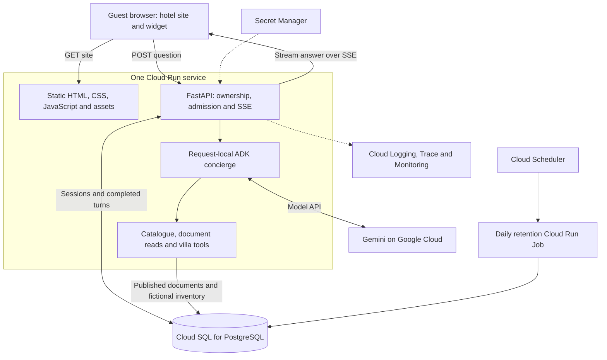
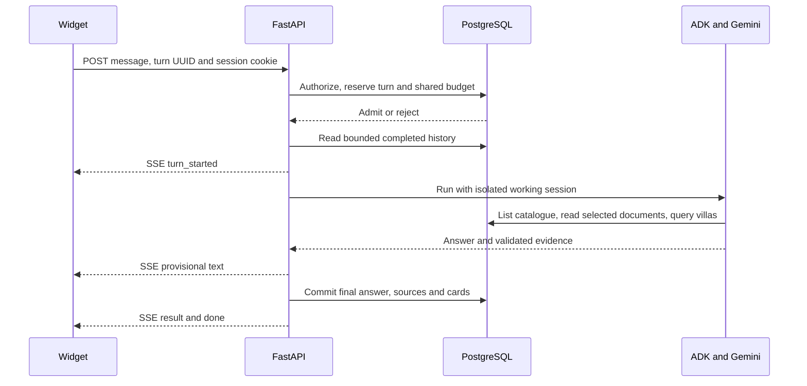

# Sanctuary Hotel: architecture

Canonical build direction, 6 October 2026. Read [Requirements](Requirements.md) first. [Linear](https://linear.app/gradientwork/project/hotel-website-agent-4f0f8e301934/overview) owns the build plan. The source pack in `hotel/` defines fictional evidence; `evals/` defines expected guest behavior.

## Current state

The first policy slice connects the static website to FastAPI, an isolated ADK invocation and local PostgreSQL. Villa tools, full turn recovery, abuse limits and deployment remain planned. Earlier unfinished implementations were not reused.

## Runtime diagram



Agents CLI and gcloud help build, evaluate and deploy the app. They are development tools, not runtime subprocesses. The agent runs in our container; a separate hosted agent runtime is not needed for this version.

## Source layout

```text
frontend/                 static hotel site, assets and browser modules
  js/                     site, chat, API/SSE and safe rendering
backend/
  app/                    settings, DB, sessions, turns, agent, tools and hotel queries
    routes/               chat, public sources and health endpoints
  migrations/             ordered SQL migrations with a transactional version ledger
  seeds/                  importer for hotel/ source files; no duplicate content
  tests/                  agent contracts and real PostgreSQL integration tests
  pyproject.toml
  uv.lock
infra/                    repeatable provisioning, release and maintenance commands
hotel/                    reviewed fictional policies, villas and nightly inventory
evals/                    fixed guest questions and expected facts
scripts/                  local run and verification commands
docs/                     requirements and architecture
resources/                concise build prompts and recording guide
compose.yaml              local PostgreSQL
Dockerfile                one image containing frontend and backend
```

This is the target layout. The first slice uses focused app modules, SQL migrations and Compose; add routes subfolders only when the growing application needs them. Infrastructure and Dockerfile remain future slices. Use plain browser JavaScript and Python async I/O. Routes call focused application modules; tools delegate to hotel queries. Keep ADK types inside the agent adapter. Avoid generic repositories, provider factories and agent teams.

## Guest turn and durable state



The widget uses POST plus `fetch()` streaming. SSE carries progressive output; JSON endpoints load history and turn status. No chat queue or WebSocket is required. A request waits asynchronously on model/network I/O while other guests progress.

PostgreSQL is the sole durable conversation record. Each invocation creates isolated ADK working state from completed turns, then disposes of it. No shared mutable agent history and no second persistent ADK history store. Later requests may reach any instance without sticky sessions.

Store guest sessions, owned conversations, immutable turn attempts, published document versions with title, summary, keywords and complete body, villas, inventory days, fictional blocking bookings and shared rate counters. A turn stores status, deadline, input, final answer, sources, cards, safe error and usage. Do not keep an open DB transaction or connection while awaiting Gemini.

## Tools and evidence

| Tool | Result |
| --- | --- |
| `list_documents()` | Complete published catalogue: ID, title, summary, keywords and current revision. No document bodies. |
| `read_document(document_id, revision)` | Complete published document at the listed revision, with title, ID and a versioned source link. |
| `get_villa(villa_id)` | Public description, capacity, amenities and approved image path. |
| `check_availability(check_in, check_out, guests)` | Deterministic full-stay availability, matching villa data and checked-at time. |

Use parameterized SQL. Missing inventory nights are unavailable; checkout is exclusive; blocking bookings and closed nights remove a villa. Validate dates, stay length and party size before lookup. The availability tool checks the fixture horizon and reports missing dates as unknown. The property timezone is `Asia/Makassar`.

Markdown policies and `hotel/catalogue.json` are the reviewed source pack. An explicit importer stores the catalogue metadata and complete document bodies in PostgreSQL. The six short documents use catalogue selection, not keyword/full-text or vector search. The agent calls `list_documents`, reads relevant documents by ID and revision, and may read several for a combined question. Summaries guide selection; only read bodies and villa tool results support factual answers. Never expose filesystem paths or let the agent run arbitrary SQL.

A read accepts only a published ID/revision. Unknown, unavailable or unpublished documents produce a structured missing-evidence response, not a guessed answer. Pin the listed revision when reading so an update cannot silently switch the evidence. Public source URLs serve the same published version used by the answer.

Re-import updates atomically: publish the new body and metadata together, retain cited versions, and exclude unpublished documents from both tools and public source routes. The agent sees changes only after successful import. A customer wiki could later feed this boundary; no wiki sync is implemented. Metadata and bodies are hotel-managed content, never instructions that override the agent's rules.

Keep a complete catalogue rather than silently truncating entries. Initial import limits: at most 20 published documents, at most 6,000 characters of catalogue JSON returned to the model, and 6,000 characters per complete body. Reject oversized input with an actionable authoring error; do not cut off conditions. Document summaries and keywords are reviewed metadata, not automatically inferred at request time. Reconsider indexed search if corpus size or evaluations outgrow these limits.

The model explains evidence and chooses tools. It cannot write bookings, run arbitrary SQL or determine authorization. Cards come from validated tool results, not generated HTML. Render model/user text as text; allow only approved source and image URLs. Evaluate document selection, cross-document reasoning and answer grounding separately.

## Ownership, retries and failure

- Use a random session token in an HttpOnly, host-only cookie. Require Secure in deployment, SameSite=Lax and a fixed 24-hour expiry. Store only the conversation ID in browser storage.
- Check session ownership for every conversation/turn read and write. Validate allowed Origin on browser mutations. An ID alone grants no access.
- Reserve one active turn per conversation in a short PostgreSQL transaction. A unique client turn UUID prevents duplicate invocations across instances.
- A repeated completed UUID returns the saved result. A running attempt provides its status URL. Failed/interrupted attempts require an explicit new attempt.
- Enforce a 90-second application deadline; initially configure the Cloud Run request timeout to 120 seconds. Platform timeout alone is not cancellation.
- Stop or disconnect cancels local work and records interruption when possible. After a crash, status/admission expires stale turns. Guard final writes against stale deadlines and newer turns.
- `done` means the answer and evidence committed. Failed persistence never produces a completed answer. Partial text is provisional. Reconnect fetches durable state; it does not resume token offsets or restart a completed model run.
- Model/tool failure shows a safe error, retry or contact option. Retry upstream 429/503 at most once before visible output/tool execution, within the same deadline.

## Capacity and cost controls

100 active turns is a measured release target, defined in Requirements. Async handlers and short DB checkouts support concurrency, but HTTP settings do not guarantee Gemini capacity.

Use one async server process per container and one pool of at most five DB connections with overflow disabled. Add bounded process-local admission for active agent runs below the HTTP concurrency setting. This is a capacity guard, not a conversation lock; PostgreSQL still owns cross-instance correctness. Reject overflow promptly with 429 and a retry/contact state instead of creating an unbounded in-process queue. Release the permit in all completion/cancellation paths. Static, health and status routes bypass model admission.

| Stage | HTTP concurrency / instance | Active agent cap / instance | Max instances | Maximum app DB connections, including two revisions |
| --- | --- | --- | --- | --- |
| Small rehearsal | 8 | 4 | 5 | 50 |
| Capacity exercise, staged 10/25/50/100 | 24 | 20 | 10 | 100 |

The small rehearsal cannot prove 100-active-turn capacity. Before higher stages, apply the capacity-exercise settings, verify model capacity and choose a SQL tier with at least 120 usable connections for application/jobs, leaving headroom for migrations and operations. Limit each job to five connections and run release migration/seed jobs sequentially; keep the remaining headroom for maintenance and operator access. Reduce caps if the selected tier cannot provide that budget. For the approved capacity-test window, warm ten minimum instances before ramping traffic and restore the normal minimum of zero afterward. This warm test measures fixed capacity; separately measure cold scale-out at the normal minimum. HTTP concurrency stays close to the agent cap so Cloud Run sees sustained chat demand; a hidden low agent cap under a large HTTP ceiling would reject work before HTTP-based scaling responds. The higher settings allow up to 200 agent slots with four HTTP slots per instance of headroom for short site/status requests; routing and throughput still need measurement. No slot calculation guarantees even request distribution. Test concurrent static/status requests during sustained chat load. Record actual CPU/memory and routing behavior, then tune from measurements. Set a three-second DB checkout timeout and measure pool waits. Confirm routing, warm capacity and the configured slot ceiling before the 100-turn stage.

Pass at most 20 completed turns and 16,000 history characters to the model. Bound input to 2,000 characters, document evidence to four distinct bodies and 24,000 characters per turn (including repeated reads), tool calls to eight and final output to 2,048 tokens. Validate and cap final result size at 64 KiB.

Shared PostgreSQL admission counters protect session creation, conversations, turns and the property as a whole. Initial defaults from this architecture: 10 turns/session/minute, 30/IP/minute and 10,000/property-local day. The property-wide minute limit must come from measured model capacity with headroom. Count failed admitted attempts too. Hash IP identifiers and expire counters. Verify the deployed proxy chain before trusting forwarded IPs. Billing alerts are notifications, not a hard spending cap.

## Retention and operations

Delete sessions and their conversations/turns 30 days after session creation. Authentication expiry does not delete data. A daily maintenance job performs cascading deletion and removes expired rate counters; Cloud Scheduler invokes it using a narrow service identity. This job is housekeeping, not queued chat execution. Reconcile backup retention with deletion before real guest use.

Log request/turn IDs, safe outcomes, tool durations, model usage and error codes. Do not log messages, raw evidence, prompts, cookies or secrets. Trace API, agent and tools. Track first-text/completion latency, failures, interruptions, admission rejection, quota errors and pool waits. Demonstrate a failed lookup and delivered alert. Include a separate DB/readiness alarm so admission failures are visible.

## Google Cloud deployment

Use project `personal-infrastructure-505708`. Provision hotel-prefixed resources; preserve other applications. Initial application/SQL region: `europe-west2`, subject to checking service availability. Select and verify the Gemini model endpoint independently; the application region need not equal the model location. Record the tested model ID rather than claiming an unverified latest model.

Use local ADC for development and a least-privilege Cloud Run identity in deployment. Separate application and migration/seed DB permissions. Runtime writes are limited to session/turn/rate data; hotel data is read-only. Credentials stay in Secret Manager and outside Git.

Release: checks and evals, immutable image, explicit migration job, explicit demo seed, Cloud Run revision, deployed SSE/ownership smoke tests. Never seed on startup. Keep migrations compatible with rollback. Keep the demo IAM-restricted until public abuse checks pass. No paid provisioning or capacity test is implied by writing this design.

| Service/tool | Role in the demo |
| --- | --- |
| Cloud Run service | Static website, FastAPI API and ADK runner in one container. |
| Gemini / Gemini Enterprise Agent Platform | Model inference and evaluation; verify chosen model access. |
| Cloud SQL for PostgreSQL | Hotel evidence, inventory, sessions and completed conversations. |
| Secret Manager and IAM | Runtime credentials and scoped service identities. |
| Artifact Registry / Cloud Build | Store and build the release image. |
| Cloud Run Jobs | Explicit migrations, demo seed and retention maintenance. |
| Cloud Scheduler | Daily retention trigger. |
| Cloud Logging / Trace / Monitoring | Investigate a failure, measure operations and notify the responder. |
| Agents CLI and gcloud | Build/eval/deployment tooling and cloud configuration. |

## Build evidence

Each Linear slice ends with a guest-visible result and recorded verification. Credential-free tests exercise the actual ADK boundary with deterministic responses and real local PostgreSQL; they cannot prove model access. A live local journey proves the selected model and tools. Deployed smoke/failure drills prove cloud behavior. The paid staged capacity exercise proves the supported load.

## References

- [Agents CLI](https://github.com/google/agents-cli): setup, existing-project enhancement, evaluation and deployment capabilities.
- [Cloud Run concurrency](https://docs.cloud.google.com/run/docs/about-concurrency): instance request settings and scaling.
- [Cloud Run request timeout](https://docs.cloud.google.com/run/docs/configuring/request-timeout): platform timeout behavior.

## First policy slice limits

The local prototype stores a single owned conversation per guest cookie and loads only completed turns. PostgreSQL prevents simultaneous submissions, and final output is saved before completion is signalled. Full repeated-turn result replay, crash recovery, shared abuse budgets and per-instance model admission belong to GRA-214. Do not expose this slice publicly. Source content is served as plain text at the exact published revision.

Ordered SQL migrations run under a transaction and advisory lock with a schema version ledger. This keeps the initial schema change path small; migrations and seeds are explicit commands, never startup side effects.
