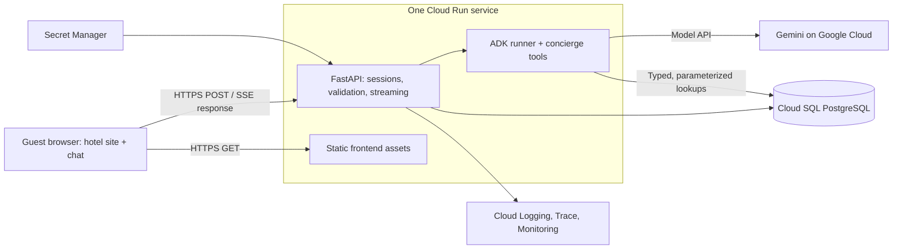

# Sanctuary Hotel agent architecture

Status: earlier architecture proposal, 27 September 2026. The [implementation design](hotel-agent/design.md), dated 3 October 2026, is the current reference for the remaining build. It preserves INV-1 through INV-6 and AC-1 through AC-8, adds implementation contracts and replaces the dual app/ADK database history proposed here with one durable application history and request-local ADK sessions. Where details differ, follow the implementation design.

The current repository contains the static website with simulated chat in `code/website/`. Backend and cloud resources remain proposed.

## 1. Executive summary

Build a hotel website with an ADK concierge that answers policy questions and
checks villa availability. Keep the existing Sanctuary design. Show useful,
structured villa cards alongside the conversation.

Use separate `frontend/` and `backend/` source directories, packaged into **one
Cloud Run service** initially. FastAPI serves static assets and `/api/*` on the
same origin. A guest sends a question over HTTP; the response streams back as
Server-Sent Events (SSE). PostgreSQL holds published documents, villa inventory,
fictional booking occupancy and durable conversations. Gemini runs through the
Google Cloud model API; the ADK agent runs inside our Cloud Run container.

No queue or WebSocket is needed for these short, interactive turns. Python async
I/O lets requests wait on the model and database concurrently. That is different
from putting work into a background queue.

## 2. Context and scope

The business problem is answering repetitive guest questions and helping visitors
find suitable accommodation without waiting for staff. The tutorial demonstrates
design, tools, deployment, evaluations and operating failures. It does not claim
to replace a hotel's booking system or prove a conversion improvement.

The primary demo: “Do you have a villa for two from 12 to 15 November?” The agent
checks inventory, returns matching villa cards, and answers a follow-up about
breakfast or cancellation using published policy sources. A conflicting booking
or missing policy produces an honest explanation, not an invented answer.

V1 uses fictional inventory in Postgres. This is a booking-system simulator,
not a live integration. A real installation must read the hotel's authoritative
reservation provider through the same typed availability interface. Availability
is a snapshot, not a hold or a booking guarantee.

## 3. System context



Agents CLI and gcloud help build and deploy this system. They are not runtime
components. No database credentials, model keys or unrestricted tools reach the
browser.

## 4. Proposed design and decisions

### Source layout

```text
frontend/                 # Existing HTML, CSS, JS, generated photography and video
backend/
  app/                    # FastAPI routes, guest sessions, ADK agent and tools
  tests/                  # Tool, API, session and streaming tests
  migrations/             # Application database migrations
  seeds/                  # Fictional policies, villas and occupancy
  pyproject.toml
  uv.lock
infra/                    # Repeatable Google Cloud deployment configuration
evals/                   # Fixed questions, expected facts and failure cases
docs/architecture.md
Dockerfile                # Packages frontend + backend into one image
```

The layout is proposed; moving the saved website is a separate implementation
step. Preserve the original assets and working preview while doing so.

One deployment avoids CORS, cross-site cookies and two release pipelines. The UI
is still static; it does not require a frontend application server. Later it can
move to a CDN/static host with an API reverse proxy if asset traffic warrants it.
Separate folders do not require separate Cloud Run services.

### Agent tools

| Tool | Source and contract |
| --- | --- |
| `search_policies(query)` | Bounded Postgres full-text search over published sections; returns passage, document ID, title and source URL. No arbitrary SQL. |
| `get_villa(villa_id)` | Public descriptions, capacity, amenities and approved image URLs. No guest or reservation details. |
| `check_availability(check_in, check_out, guests)` | Validated dates and occupancy, deterministic SQL; returns available villas, searched dates, guest count and checked-at time. |

Start with full-text retrieval for a small curated guide. Add embeddings only if
evaluations show a recall problem that curated wording and synonyms cannot solve.
The model chooses tools and explains their evidence; it does not calculate
inventory, invent prices, generate SQL or decide authorization.

Dates such as “next week” require clarification before an availability lookup.
The property timezone is configured as `Asia/Makassar` for the fictional Bali
resort. V1 supports one villa per search and an integer total guest count. Age-based
occupancy rules, multi-room allocation and pricing are outside the first version.

### HTTP and SSE

`POST /api/conversations/{id}/turns` accepts JSON and returns
`text/event-stream`, consumed with browser `fetch()` and its readable stream.
Native `EventSource` is not required because it does not send a POST body.
Events are `turn_started`, `status`, `text_delta`, `result`, `done`, or `error`.
`result` contains validated sources and availability cards; `done` is emitted only
after the completed turn has been saved. Heartbeat comments keep idle streams
observable, but do not extend the server deadline.

Streamed text is provisional until `done`. Villa cards come from validated tool
results, not model-generated HTML or free-form JSON. The UI escapes text and
renders a fixed card component. Cards show the searched dates, villa capacity,
photo and “View villa”. Do not show a fake “Book now” or fictional live price.

SSE fits one question followed by progressive server output. WebSockets become
useful for continuous two-way audio or other full-duplex interaction. Neither
transport makes model quotas or database capacity unlimited.

```mermaid
sequenceDiagram
    participant Guest as Widget
    participant API as FastAPI
    participant DB as Postgres
    participant Agent as ADK + Gemini
    Guest->>API: POST question + client turn ID + session cookie
    API->>DB: Authorize conversation; atomically admit turn
    API-->>Guest: SSE turn_started
    API->>Agent: Run with persisted history and tool contracts
    Agent->>DB: Read published policies / available villas
    DB-->>Agent: Bounded evidence
    Agent-->>API: Answer and tool results
    API-->>Guest: SSE text deltas
    API->>DB: Save final result; mark complete
    API-->>Guest: SSE result + done
```

## 5. Invariants

- INV-1: Every conversation and turn read/write is authorized against the guest
  session. Knowing a conversation ID is not sufficient.
- INV-2: At most one active turn per conversation across all instances. Different
  conversations may run concurrently. The model never has global mutable history.
- INV-3: A client turn ID identifies one attempt. Network retries do not create
  another model run for that ID.
- INV-4: Only database evidence produces availability cards. No lookup result is
  represented as a reservation, hold, verified guest identity or live quote.
- INV-5: The agent's hotel tools are read-only. App session persistence is separate
  from tool authority. No reservation mutation is exposed to the model.
- INV-6: Completed user-visible turns and their evidence survive instance restart.
  An interrupted turn is never silently represented as complete.

## 6. Interfaces and data

### Application API

| Endpoint | Behavior |
| --- | --- |
| `GET /policies/{slug}?version={version}` | Renders a public policy page from published database sections using a fixed escaped HTML template; 404 for unpublished/unknown versions. |
| `POST /api/session` | Creates opaque guest session and secure cookie, subject to shared rate limits. |
| `POST /api/conversations` | Creates conversation owned by that session. |
| `GET /api/conversations/{id}` | Returns owned history and turn states. |
| `POST /api/conversations/{id}/turns` | `{client_turn_id, message}`; validates and starts streamed turn. |
| `GET /api/conversations/{id}/turns/{turn_id}` | Returns durable state/result after interrupted streaming. |

Before streaming, use 400 for invalid input, 401 for expired sessions, 404 for
unknown/unowned objects, 409 for a different active turn and 429 with Retry-After
for rate limits. During a stream, use a typed `error` event with a safe message
and request ID. Never expose exception traces or prompts.

A duplicate completed turn returns its stored result without running the model.
A duplicate running turn returns 409 with its status URL; the widget checks status
instead of resubmitting. Failed/interrupted attempts remain immutable; an explicit
“Try again” starts a new client turn ID.

Citation links use the policy route above and the exact retrieved published
version. Published versions are immutable; editing creates a new version. Old
published versions remain readable and are labelled superseded when applicable.
Unpublishing a version removes public access and existing citations return 404;
conversation history retains the recorded source title/version, not privileged
access. Test citation rendering and draft exclusion as part of AC-1.

### PostgreSQL records

- `guest_sessions`: hash of opaque token, expiry; no booking identity.
- `conversations`: session owner, ADK session mapping, active turn ID.
- `turns`: unique `(conversation_id, client_turn_id)`, status, start/deadline,
  input, final answer, sources, card payload, safe error code, model usage.
- ADK database session tables: durable runner events/state, isolated from app
  schema. Pin ADK version and validate its migrations before deployment.
- `documents` and `document_sections`: title, public slug, publication state,
  version, plain text and indexed search vector.
- `villas`: physical unit ID, name, capacity, public description, amenities,
  allowlisted image path, active flag.
- `inventory_days`: unique `(villa_id, stay_date)`, open/closed flag. Missing dates
  are unavailable, not implicitly open.
- `bookings`: fictional villa ID, check-in, check-out, blocking status. No guest
  PII is needed. Maintenance closures use closed inventory days.

Application `turns` are the authoritative UI record; ADK session events support
reasoning history. Each attempt maps to a runner session generation. On incomplete
or failed attempts, discard that generation and create the next runner session
from completed app turns only. Never reuse partially written ADK history. This
keeps the two stores from disagreeing about which answers the guest received.

Availability requires capacity >= guests, an open inventory row for every night,
and no blocking booking with `booking.check_in < requested.check_out AND
booking.check_out > requested.check_in`. Date intervals are checkout-exclusive;
back-to-back stays are allowed. Reject past dates, non-positive stays, more than
30 nights, or dates beyond the seeded 365-day horizon. Return “outside our demo
availability period” distinctly from “sold out”. Query all evidence in one
consistent read transaction and return its checked-at timestamp.

## 7. Failure and lifecycle

Admit a turn under a short database transaction locking the conversation row.
Do not hold this lock, transaction or a connection while waiting on Gemini.
Record a fixed 90-second execution deadline and run within it; configure the
Cloud Run request timeout to 120 seconds. These are initial application choices,
not measured latency promises.

On disconnect, cancel the runner and mark the turn interrupted when possible.
If the container dies first, status reads and subsequent admissions lazily expire
a stale running turn after its deadline. A final write must compare active turn
ID, running state and deadline; late output cannot overwrite a newer turn.
No resume of token offsets in v1: reconnect fetches the durable result or tells
the guest the turn was interrupted. Never automatically re-run a completed turn.

A failed tool returns an explicit unavailable result. The assistant may explain
that limitation; it must not produce availability cards. Model failure produces
a retry option and the hotel's published contact details. V1's “Contact hotel”
is a normal contact link, not a claim that a staffed live chat or ticket exists.

No work is promised to continue after the HTTP request ends. Future notifications,
document imports or confirmed host requests may need durable jobs/outbox delivery.
That is the point to introduce a queue, separately from interactive chat.

## 8. Security, operations and resource limits

Use an opaque 256-bit session cookie: HttpOnly, Secure, SameSite=Lax, host-only,
24-hour expiry. Validate Origin on state-changing browser requests. CORS is not
authentication. Every ID lookup verifies session ownership. Public visitors can
check inventory but cannot see guest bookings or personal data.

Treat documents, user text and model output as untrusted. Tools accept typed
arguments with server-side bounds; use parameterized SQL and no outbound arbitrary
URLs. Serve only published documents, never internal staff notes. Runtime database
roles cannot alter migrations or hotel inventory. A separate migration/seed role
owns those changes. Use a Cloud Run service identity and Secret Manager instead
of committed keys; limit model and Cloud SQL permissions to this deployment.

Initial admission limits: 2,000 characters per question, 20 completed history
turns passed to the model, 5 retrieved passages of at most 2,000 characters each,
8 tool calls and 2,048 output tokens per turn. Apply a shared Postgres-backed
limit of 10 turns per session per minute, 30 per client IP per minute, plus a
configurable property-wide daily turn budget; check atomically before model calls.
Protect session creation too. Hash IP identifiers and expire rate buckets.
Behind proxies, trust only the configured platform forwarding chain, not arbitrary
client headers. Budget exhaustion returns a contact fallback. Cloud billing
alerts alone do not stop spending.

Start with Cloud Run concurrency 8 and a maximum of 5 instances, one async server
process per instance. Use short-lived pooled DB checkouts, with at most 5 total
connections per instance across application and ADK pools. Budget database
connections for overlapping revisions during rollout plus migrations. Tune only
after load tests and checking model quotas. Thousands of open website sessions
are different from thousands of simultaneous model generations; no such throughput
claim is established by this design.

Log request/turn IDs, tool names, durations, outcomes and model token counts.
Do not log guest text, full tool evidence, cookies or secrets by default. Traces
link API, model and tool calls. Monitor time to first output, total latency,
interrupted/error rate, empty searches, DB pool saturation and quota errors.
Initial alert: at least five failed turns and >10% failure over five minutes.
Seed a failed DB lookup for the tutorial failure drill.

Delete session/conversation content after 30 days via a scheduled maintenance job;
expired authentication alone is not deletion. Align backup retention with the
same documented policy before real guest use. Demo seeds contain no real PII.

Build one immutable image; run migrations as an explicit release step, seed only
in demo environments, then deploy a Cloud Run revision and smoke-test streaming.
Use backward-compatible migrations so previous image rollback remains possible.
Keep region/model configurable and verify availability and quotas before deployment.
Cloud SQL stays in the application region. Enable backups and test restore before
using this for a real hotel. CI tests and evals gate releases; no automatic cloud
resource creation or deployment is authorized by this document alone.

## 9. Acceptance criteria

- AC-1: A policy question returns the correct fact and a working published source.
- AC-2: Exact-date searches return only villas available for the whole stay;
  relative dates trigger clarification. Cards match deterministic tool results.
- AC-3: A cancelled booking does not block inventory; an active booking, closed
  night or missing inventory day does. Adjacent check-out/check-in is allowed.
- AC-4: A second browser session cannot read or invoke another session's history.
- AC-5: Concurrent turns, duplicate POSTs, disconnects and killed instances obey
  INV-2/3/6. No late completion corrupts the conversation.
- AC-6: Model/tool failure, quota exhaustion and daily budget exhaustion produce
  honest UI states without invented availability or leaked internals.
- AC-7: The deployed site streams, preserves completed history across revisions,
  respects reduced-motion behavior, and retains the existing hotel design.
- AC-8: A failure drill is traceable from UI request ID to failing tool; logs
  exclude guest content. Cleanup removes expired retained conversation data.

## 10. Test approach

Use unit tests for SQL date boundaries and tool contracts (AC-1/2/3), integration
tests against real PostgreSQL for ownership, uniqueness, locking and recovery
(AC-4/5), and mocked dependency faults for limits and fallback behavior (AC-6).
Run a fixed evaluation dataset including unavailable policies, ambiguous dates,
prompt injection and attempted reservation writes. Deterministic checks prove
inventory and tool permissions; an LLM judge only supplements answer assessment.

Browser tests verify SSE split-frame parsing, partial output, final cards,
refresh/reconnect, expired cookies and mobile layout (AC-5/7). Deployed smoke and
failure drills verify actual buffering, timeouts and observability (AC-7/8).
Start load testing at 20 simultaneous turns in distinct conversations, measure
p95 completion and error rate, and record model/region/configuration. This is a
baseline measurement, not proof of support for thousands. Increase traffic only
within an explicit cost budget and available quota.

## 11. Risks and tradeoffs

One service shares capacity between static assets and agent traffic. This is
acceptable for a tutorial; a CDN is the first separation if asset load matters.
Postgres full-text search may miss paraphrases, so retrieval evals decide whether
semantic search is needed. Availability seed data can mislead if the UI omits its
demo label. Real reservation integration needs freshness, outages and rate limits
specified against an actual provider before advertising real availability.

## 12. Open questions and defaults

No unresolved choice blocks this design. Defaults: single fictional hotel,
read-only availability, no prices, no reservation creation, one Cloud Run service,
SSE, curated Postgres documents and seeded inventory. Calendar integration and
confirmed host requests from the earlier outline move to a later extension.

Before implementation/deployment, select a supported Gemini model and region,
verify sponsor terminology and required product coverage, and agree a cloud spend
limit. Before real hotel use, choose the reservation provider, content owner,
data-retention requirements and operational contact. These are release gates,
not reasons to add extra infrastructure to the prototype now.

## 13. Out of scope

Payments, reservation mutations, authenticated booking lookups, WhatsApp,
multi-hotel tenancy, live staff inbox, automatic follow-up, autonomous background
agents, vector databases, multi-agent orchestration and a CMS editing interface.

## Technical references

- [Cloud Run concurrency](https://docs.cloud.google.com/run/docs/about-concurrency)
  describes configurable per-instance concurrency and scaling tradeoffs.
- [Cloud Run request timeouts](https://docs.cloud.google.com/run/docs/configuring/request-timeout)
  inform the bounded request lifecycle; an HTTP timeout alone is not cancellation.
- [ADK API server](https://github.com/google/adk-docs/blob/main/docs/runtime/api-server.md)
  includes an SSE execution endpoint. Our application wraps ADK with its own
  ownership, admission, persistence and public response contracts.
- [ADK session services](https://github.com/google/adk-docs/blob/main/docs/sessions/session/index.md)
  describes database-backed session persistence. Pin and test the chosen version.
