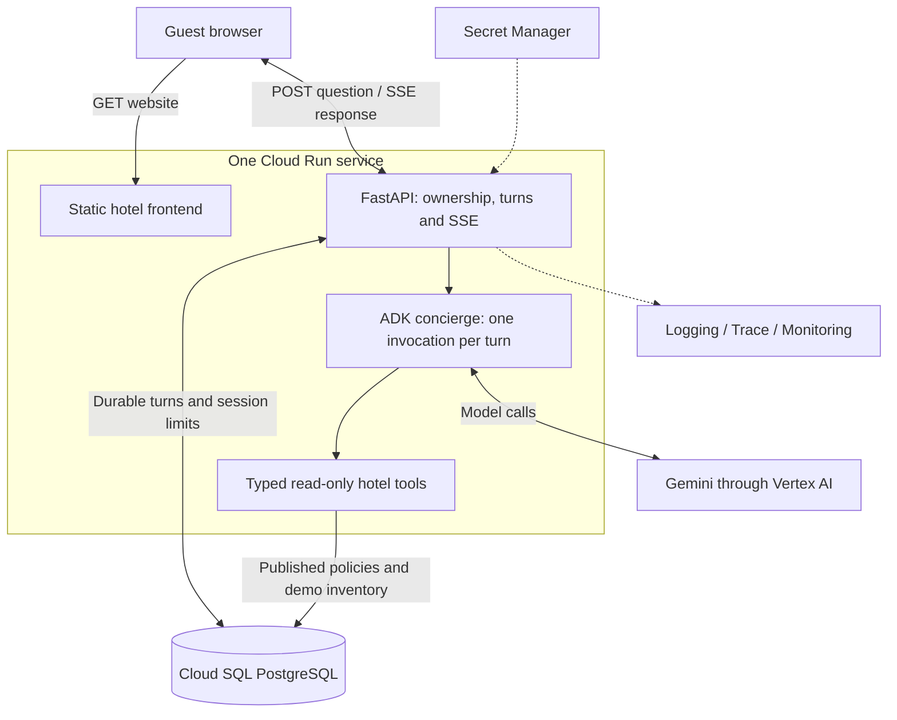
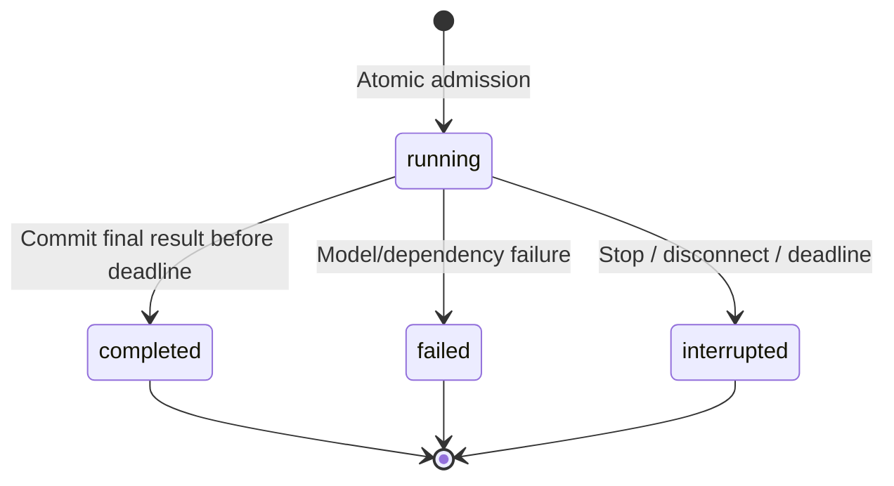

# Sanctuary Hotel: implementation design

> **Current foundations:** [Requirements](../Requirements.md) and [Architecture](../Architecture.md) are canonical. This document retains detailed contracts and checks; current deployment choices take precedence.

> **Status:** Reviewed proposal; Claude approved the design, 3 October 2026. Defines the remaining application. No backend or infrastructure is implemented by this document.

## 1. Executive summary

The saved hotel website looks finished, but its concierge returns scripted answers and prepares fake requests. Build a real guest-facing concierge that answers published hotel questions, finds available villas and remembers completed conversations. Target 100 simultaneous active agent turns in independent guest conversations, not merely 100 connected or browsing visitors. Keep the existing design and photography.

Use one Cloud Run service containing the static website and a Python FastAPI/Google ADK backend, with Gemini through Vertex AI and Cloud SQL for PostgreSQL. Stream responses with Server-Sent Events (SSE). Keep PostgreSQL as the sole durable conversation record and reconstruct the agent's context for each turn. The cost is some extra history processing and no recovery of unfinished model runs. That is acceptable for a short, read-only conversation.

This is a tutorial application with fictional inventory. It becomes a real hotel's availability integration only when its tool reads that hotel's booking provider.

## 2. Context and scope

Verified starting point: `code/website/index.html`, `style.css`, `app.js` and `assets/` contain the Sanctuary Hotel prototype. The script currently invents guide answers, activities and a host request with a fake reference. There are no backend, migrations, agent dependencies or cloud deployment files. Preserve the homepage, carousel, menu, video and reduced-motion support. Replace simulated concierge behaviour rather than mixing mock answers with live ones.

The finished journey is: ask about breakfast, open a published policy source, supply exact dates and guest count, see available villa cards, ask a follow-up, refresh and recover the completed conversation. Missing evidence, ambiguity and failed lookups have visible outcomes.

V1 covers one fictional hotel, one villa per party (a search may return several alternatives), read-only hotel tools, anonymous browser sessions and a contact link. No staff inbox, fake request submission, prices, booking creation, private guest records, WhatsApp or administrative UI.

This document supersedes the implementation details in [the earlier architecture draft](architecture-original.md). Its existing INV-1 through INV-6 and AC-1 through AC-8 retain their meanings below. In particular, this design replaces the earlier proposal for separate ADK database session tables and session generations with a single durable application history.

## 3. System context



The browser never receives database credentials, model credentials or direct tool access. Google Cloud service identity controls resource access. Agents CLI and gcloud are development tools, not server subprocesses.

## 4. Proposed design

### How it works

The widget opens an anonymous session, then creates a conversation. It stores only the opaque conversation ID in browser storage; the authorization token remains in an HttpOnly cookie. On refresh it fetches owned history. The guest submits “A villa for two, 12 to 15 November 2026” with a client-generated turn UUID.

FastAPI validates ownership, message bounds and shared budgets. In one short database transaction it locks the conversation, expires any stale active turn, reserves the new turn and increments admission counters. It releases the database connection before starting Gemini.

The agent adapter loads the latest completed text pairs and creates a fresh, isolated ADK runner session. Gemini selects `check_availability`; the tool validates the dates and runs deterministic SQL. The application records the typed result for this invocation. It streams plain answer text, then saves the final answer and validated sources/cards in one transaction. Only after that commit does the widget receive the final result and `done`.

A follow-up reuses completed text history, but fresh availability always requires a fresh lookup. Prior assistant text is conversational context, not an inventory source. Partial or failed turns never enter the next model context.

### File layout

Use plain HTML, CSS and browser JavaScript. No React, Node application server or frontend build pipeline is required. Use browser ES modules to separate site behaviour from the chat client.

```text
frontend/
  index.html
  styles.css
  js/
    site.js                 # Menu, carousel, hero and reduced motion
    chat.js                 # Widget state, recovery and user actions
    api.js                  # JSON requests and fetch-based SSE parsing
    render.js               # Safe text, source links and fixed villa cards
  assets/                   # Existing images and hero video
backend/
  pyproject.toml
  uv.lock
  app/
    __init__.py
    main.py                 # create_app, lifespan, middleware, static mounts
    config.py               # Typed environment settings
    db.py                   # One async engine/session factory
    models.py               # SQLAlchemy table mappings
    schemas.py              # Pydantic API/tool/result contracts
    sessions.py             # Cookie issuance, ownership and expiry
    turns.py                # Admission, finalization, recovery and budgets
    agent.py                # ADK construction, history hydration and event adapter
    tools.py                # Three ADK tool wrappers and evidence capture
    hotel.py                # Policy and availability queries
    routes/
      chat.py               # Session, conversation and turn endpoints
      policies.py           # Public source pages
      health.py             # Liveness/readiness
    telemetry.py            # Logs, spans, metrics and redaction
    cli.py                  # Seed, retention cleanup and evaluation commands
    templates/
      policy.html           # Escaped public policy template
  migrations/               # Alembic revisions, no startup schema creation
  seeds/
    hotel.json              # Fictional published content and villa records
  tests/
    conftest.py
    test_hotel.py
    test_sessions.py
    test_turns.py
    test_agent.py
    test_routes.py
frontend/tests/             # Focused browser/SSE tests
infra/
  provision.sh              # Idempotent, reviewed gcloud resource setup
  deploy.sh                 # Image, migration job, revision and smoke check
  cleanup.sh                # Inventory resources before approved teardown
  config.example.env        # Non-secret project/region/limits examples
  README.md                 # Provision, release, rollback and teardown
scripts/
  dev.sh                    # Start API, serving frontend
  check.sh                  # Format/lint/type/tests
compose.yaml                # Local PostgreSQL only
Dockerfile                  # One non-root app image
.dockerignore
.env.example                # Variable names and safe example defaults
.github/workflows/check.yml # Credential-free checks
evals/                      # Fixed evaluation inputs
  cases.json                # Fixed guest questions and expected evidence
  README.md                 # Run, interpret and compare results
docs/hotel-agent/design.md  # This proposal
```

Keep generated evaluation results out of Git.

Dependencies flow from routes to sessions/turns/agent/hotel, then to db and schemas. `tools.py` delegates to `hotel.py`; tools never import routes or write conversation state. `agent.py` is the only module importing ADK and model SDK types. Plain validated results cross that boundary. `main.py` builds shared dependencies explicitly; avoid import-time clients.

Start with these cohesive modules. Split a module only when it gains a separate responsibility. Do not add generic repositories, a service container, plugin registries, agent teams or provider factories. SQLAlchemy async with asyncpg, Alembic, Pydantic settings, pytest and Ruff are enough. Add a focused type check to the ADK adapter and application modules. Pin tested versions in `uv.lock`.

Move the site from `code/website/` to `frontend/` during implementation, update README, preview commands, asset verification and lesson links together, then remove the old duplicate. Move the existing asset checker into `scripts/` and keep its design checks. Root Docker context must include both frontend and backend. API and policy routes take precedence over the static mount; unknown API paths return JSON 404, never the homepage.

### Decisions

**One service and one origin.** FastAPI serves the website and API. This removes CORS and cross-domain cookies from V1. Static assets share capacity with agent requests; add a CDN only after measuring a need.

**SSE over POST.** Use `fetch` with a streamed response. A queue adds durability that this short request does not promise; WebSockets add connection management without a two-way streaming requirement. SSE still requires explicit parser, timeout and cancellation tests.

**One durable history.** Persist app turns in PostgreSQL, not both app turns and ADK session tables. For each invocation create an isolated `InMemorySessionService`, append completed user/model text events through ADK's public API, run the current message, then dispose of the service. No shared app/user ADK state, mutable runner history or unfinished tool events survive. The memory store is request-local working state, not production persistence. Prove hydration against the pinned ADK version before building the rest of the adapter. Reject a replay approach that requires monkey-patching SDK internals. Live tool evidence is retained separately in app results for UI/audit.

**Full-text policy search.** A small curated handbook with indexed Postgres text search is sufficient to start. Publish aliases for common guest phrases. Evaluate retrieval before adding embeddings. The model chooses tools; SQL decides availability.

**One deployment owner.** Use small reviewed gcloud scripts for provisioning,
release and teardown. They check existing resources before creating them and
print the intended project/resource changes. There is no competing Terraform
image state. Keep secrets out of script arguments, logs and tracked configuration.
The recording can drive these scripts through coding-assistant prompts.

### Concurrent guests

This is a public website service for many independent visitors. There is no
single global agent worker or shared conversation. Each admitted turn owns an
isolated runner, working session and evidence collector. Only immutable configuration and a concurrency-safe model client may be
shared. `run_turn` constructs a new Agent, Runner, InMemorySessionService and
evidence collector per invocation. Tool closures capture that collector and
read-only hotel dependencies. Render the instruction with the bounded public
villa catalogue and today's property-local date, treating catalogue text as data.
No mutable Agent, ToolContext or collector is shared across guests. Tools use async I/O and short DB checkouts.

Cloud Run distributes concurrent HTTP requests and adds instances up to the
configured cap. Start with request concurrency 80 and maximum 10 instances. This is a limit
on all HTTP requests, including assets, status reads and streaming turns, not
a promised number of model runs per instance. It provides request headroom
while testing 100 active agent turns. This is
a configuration envelope, not evidence that the model or database sustains it. The concurrency limit
must account for static/API traffic too. Many more visitors may browse the site
or hold inactive conversations. Raising active-generation capacity requires
matching model quota, DB connection budget, memory and a measured load test.

Serialize only turns in the same conversation. Different conversations must
never wait on a global conversation lock or share ADK session IDs. Shared budget
rows are held only for short admission transactions; the daily counter is a
potential bottleneck to measure. Configure clients to receive 429/503 with an
honest retry state under overload. A browser's SSE stream is bound to the
instance handling that turn; later history/status requests can reach any instance.
Sticky sessions are unnecessary.

### Capacity target and proof

For this design, 100 concurrent users means 100 distinct conversations with
agent invocations in flight together. The handler awaits model/network I/O
without blocking other turns. Five pooled DB connections per instance are not
five chat slots: connections are checked out only for brief reads/writes.

Each turn can make several sequential model requests. Required model request
and token capacity must be calculated from observed calls/tokens per turn and
p95 duration. Record whether the model uses Dynamic Shared Quota (DSQ) or
Provisioned Throughput. DSQ has no guaranteed per-project capacity number; set
admission from measured staged throughput with headroom. For provisioned or
fixed quotas, verify the purchased/allocated capacity. Record the actual capacity
basis and upstream errors. HTTP scaling cannot guarantee provider capacity.

Start with 10 users, then 25, 50 and 100, using synthetic sessions and realistic
policy and availability tool loops. Sustain 100 in-flight invocations for at
least five minutes, replacing completed turns with new attempts in independent
conversations. Use distributed real load sources, or a private APP_ENV=demo deployment with
an explicit DEMO_IP_LIMIT_OVERRIDE for a single-source capacity test. Production
rejects that override at startup. Never forge forwarded IPs. Record whether IP
limiting was actually exercised; a single-source override proves capacity but
not the public abuse policy. Keep per-user cadence within its limits and respect
the agreed paid-test budget. Restrict pre-release Cloud Run with
--no-allow-unauthenticated; the load generator supplies an identity token for an
authorized invoker, alongside separate guest cookies and the allowed Origin.

Acceptance at 100: at least 99% of admitted turns complete within the 90-second
application deadline, no server-owned timeout/dependency error exceeds 1%, no application
admission rejection under the configured normal-load target, and zero
ownership leaks, duplicate invocations or stuck conversation locks. Upstream 429/503 surviving the bounded retry count toward the error budget, not as
application admission rejection. Record p95
first-text latency and completion time, token/call usage, DB waits and peak
memory. This is a release gate until measured. In-memory fake-model tests prove
application concurrency; only the deployed live-model test proves end-to-end
capacity. If quotas or cost prevent the test, record the target as unverified.

## 5. Invariants and requirements

- **INV-1:** Every conversation/turn read and write checks its browser-session owner. An ID alone grants no access.
- **INV-2:** At most one active turn per conversation across all instances. Different conversations can run concurrently; model history is isolated.
- **INV-3:** One client turn ID identifies one attempt. Repeating it does not launch another model invocation.
- **INV-4:** Only successful typed database evidence produces availability cards. Availability is never represented as a reservation, hold or live quote.
- **INV-5:** Hotel tools are read-only. Application persistence is separate; the model cannot mutate reservations or hotel data.
- **INV-6:** Completed turns and evidence survive restarts. Interrupted output is never silently represented as complete.
- **INV-7:** `done` means the final answer and evidence are committed. Partial text is not canonical history.
- **INV-8:** Model output and retrieved content cannot grant tool permissions, become HTML or introduce arbitrary URLs.

The widget must support desktop/mobile, keyboard controls, readable contrast, loading, stop, retry, reconnect, expired session, no availability and contact hotel. “New conversation” starts a new owned conversation; it does not delete prior history. Closing the widget hides it without cancelling an active request. “Stop” aborts it. Remove fake guest room identity, request IDs and host submission. The contact link is ordinary published hotel contact information, not a live staff handoff.

## 6. Interfaces and data

### HTTP and SSE

All times are UTC instants except stay dates, which use property-local calendar dates (`Asia/Makassar`). API JSON is snake_case with UUID strings and ISO dates. Schemas forbid unknown input fields. Responses have `Cache-Control: no-store`; the stream additionally uses `text/event-stream` and disables application buffering.

| Endpoint | Contract |
| --- | --- |
| `POST /api/session` | Create a cookie if absent/expired; otherwise reuse it. Subject to creation limits. |
| `POST /api/conversations` | Create conversation for current session; returns ID. |
| `GET /api/conversations/{id}` | Return owned turns and any active status; paginate at 50 turns. |
| `POST /api/conversations/{id}/turns` | `{client_turn_id, message}`; success is SSE. |
| `GET /api/conversations/{id}/turns/{turn_id}` | Return durable state, safe error or completed answer/evidence. |
| `GET /policies/{slug}?version={version}` | Escaped public page for that published immutable version; without version show the current published version. Unknown/unpublished is 404. |
| `GET /health/live` | Process responds. No dependency calls. |
| `GET /health/ready` | Valid configuration and bounded DB query; no paid model call. |

Before streaming return 400 invalid input, 401 absent/expired cookie, 404 unknown/unowned object, 409 busy conversation and 429 exhausted budget with Retry-After. Failed DB dependency returns 503. Include a request UUID in all errors. Unknown/unowned objects use the same response shape.

SSE events: `turn_started` contains the client turn ID and status URL; `status` is an allowlisted progress label; `text_delta` contains plain text; `result` contains the persisted answer, sources and cards; `done` contains turn ID; `error` contains safe code, message and request ID. Emit `result` and `done` only after commit. A completed duplicate replays `turn_started`, stored `result`, `done`; it never replays deltas. A duplicate running attempt returns 409 with its owned status URL. A failed/interrupted duplicate replays `turn_started` then a terminal `error` event without execution. Same ID with different normalized text returns 409 `idempotency_conflict`. Check ownership and the idempotency record before busy checks or reserving budgets, so recovery of an existing attempt works even during another active turn or exhausted admission budget.

The browser parser handles UTF-8 split chunks, CRLF, multiline data, comments
and several events per chunk. A heartbeat comment every 10 seconds prevents
silence without changing deadlines. The client creates and retains its UUID before POST, and the status URL is addressable by that UUID even if turn_started never arrives. On EOF before `done`, make one status GET,
with at most two retries two seconds apart if still running. A completed record
replaces provisional text; interrupted/failed records offer an explicit new
attempt. If still running or the DB is unavailable, show “Unable to confirm the
result” with “Check result” and the recorded deadline. Do not keep polling for
90 seconds or automatically resend. “Check result” retries status; after the
deadline the server lazily expires stale running work and permits a new turn.
Recovery is for lost final delivery or a commit/disconnect race, not for resuming
work cancelled by disconnect. Refresh uses the same recovery flow. Status 404
means no attempt currently exists; a resend of the same UUID is safe even if
an earlier POST later arrives, because uniqueness and admission serialize it.
Explicit retry after a failed/interrupted attempt always creates a new UUID.

### Tools and structured output

| Tool | Inputs and bounded result |
| --- | --- |
| `search_policies` | Query <=200 characters; up to five published passages <=2,000 characters each, source ID/title/version and server-built relative URL. |
| `get_villa` | Stable public villa slug; public name, description, capacity, amenities and local image/anchor. Unknown slug returns `not_found`. |
| `check_availability` | Exact check-in/out dates and total guests; up to six matching villas, `more_available`, date range, guests, checked_at, horizon and explicit outcome. |

Tool outcome values distinguish `ok`, `no_matches`, `outside_demo_period`, `invalid_input` and `unavailable`. No arbitrary SQL, free-form HTTP fetch or private booking record is returned. The agent asks for missing dates/guests. An empty policy search gives an honest limitation and a contact option.

Load a bounded public catalogue of active villa names/slugs from PostgreSQL into the invocation context, so a fresh question about a named villa can call `get_villa` without first searching dates. Descriptions still come from the tool. Match only real slugs, ask for clarification on ambiguous names, and keep physical UUIDs internal. Cap the V1 catalogue at 20 physical villas; a larger property needs a bounded search tool before expansion.

Request-local tool wrappers capture successful evidence. Cards are built from the last successful availability result in that turn, not from text parsing. If a subsequent availability lookup fails, clear earlier cards to avoid showing stale alternatives. Sources are labelled “References consulted”; an evaluation verifies the answer agrees with them, without claiming every consulted passage was cited by the model. Server allowlists villa paths and constructs policy URLs. No model-generated card markup is accepted.

### Configuration

`config.py` validates `APP_ENV` (local/demo/production), `PUBLIC_ORIGINS`,
`GOOGLE_CLOUD_PROJECT`, `GOOGLE_CLOUD_LOCATION`, `GEMINI_MODEL`,
`DATABASE_URL`, `HOTEL_TIMEZONE`, `HOTEL_CONTACT_URL` and `IP_HASH_SECRET` and `PROPERTY_TURNS_PER_MINUTE`. `DEMO_IP_LIMIT_OVERRIDE` overrides both turn and session-creation IP limits in demo capacity tests; production rejects it.
The pinned ADK model accepts an explicit shared Gen AI client configured with `vertexai=True`, project, location and retry settings. Test client identity through its public `api_client` property; no environment-only SDK routing is required. Cloud execution
also provides `PORT` and the Cloud SQL instance connection name. Admission,
pool and timeout defaults above are typed settings with bounded overrides;
secrets never appear in configuration summaries. The Cloud SQL connector
constructs the cloud connection, while local development uses the compose DB.
The final pinned connector/driver combination must be proved in a cloud smoke
check, not inferred from a local PostgreSQL test.

`APP_ENV=demo` alone may enable a named availability-failure drill through
operator-controlled revision configuration. There is no public failure-toggle
endpoint. Production rejects fault-injection configuration at startup.
`HOTEL_CONTACT_URL` is an operator-approved HTTPS or mailto URL rendered by
fixed UI code; Gemini cannot override it.

### Tables and identity

| Table | Important fields and constraints |
| --- | --- |
| `guest_sessions` | Server UUID, unique hash of 256-bit random cookie token, expires_at. |
| `conversations` | Server UUID, owner FK, created_at. The active turn is queried from turns, with no duplicate pointer. |
| `turns` | Conversation FK and client UUID as composite primary key, normalized message/hash, running/completed/failed/interrupted state, created_at from DB clock_timestamp() under admission lock, deadline, answer, result JSON, safe error, token counts; partial unique conversation ID WHERE state = running. This enforces one running turn across instances. |
| `policy_versions` | UUID, stable slug, title, increasing version, published flag, superseded flag; unique slug/version and partial unique slug where published AND NOT superseded. |
| `policy_sections` | Version FK, section key/order/text, indexed text search vector. |
| `villas` | Stable physical unit UUID, unique slug, public description/capacity/amenities/image, active. |
| `inventory_days` | Villa/date composite key, open boolean; missing day is unavailable. |
| `bookings` | Demo ID, villa FK, check_in/out, blocking/cancelled status; no guest PII. |
| `schema_contract` | Singleton schema_version and min_app_schema; migration-owned compatibility contract. |
| `rate_buckets` | Scope/key hash/window, admitted count, expiry; unique bucket. |

History, context selection and cursor pagination order by (created_at, client_turn_id), with an index on (conversation_id, created_at, client_turn_id). The database clock_timestamp() sets created_at during locked admission; client UUID randomness never decides chronology.

Answer, sources and card payload are bounded JSON; full ADK/tool traces do not become a second session database. Store explicit searched dates and selected villa slugs with the completed turn so subsequent context can refer to those facts. The newest completed result provides this context, labelled as historical. Always recheck current availability before returning new cards.

Session/conversation UUID collision fails insertion and regenerates once. Public turn_id is the client-generated UUID scoped by conversation; there is no second server turn ID. Client ID conflict follows the API rules above. Villa IDs and policy slugs remain stable across display-name edits. A changed policy creates a new immutable version. Policy search filters published AND NOT superseded. Publishing a replacement updates the prior current version to superseded before inserting/publishing its replacement, in one transaction; the partial index permits at most one current published version per slug. Published old versions remain accessible and labelled superseded; unpublishing returns 404 while saved conversations keep only the recorded public title/version. No privileged document access is inferred from old citations.

Seed a rolling 365-day period anchored to the property-local date when the demo seed command is explicitly run. Store its bounds as seed metadata. Do not silently rewrite occupancy at startup. Stay must start today or later, last 1–30 nights, fit the entire seed horizon, and request 1–8 guests. A villa requires sufficient capacity, open inventory for every night and no blocking booking where `booking.check_in < check_out AND booking.check_out > check_in`. Checkout is exclusive. Read availability in one snapshot transaction.

## 7. Failure behaviour and lifecycle



Use the database clock for a fixed 90-second execution deadline and a Cloud Run HTTP timeout of 120 seconds. The execution timeout covers history loading, hydration, model/tool work and finalization. Each DB checkout times out within three seconds; each statement within five seconds. Each model request is limited by remaining turn time. Allow at most one jittered (250–750ms) retry of a single model HTTP request on 429/503 before it yields response content or tool calls, within the remaining turn deadline. Do not restart the whole agent loop, replay tools or retry a partially delivered model response. Disable additional SDK retries. Log the retry and include it in request/usage accounting. Read-only tools make this bounded request retry safe; it does not start a second admitted application turn. Permit one retry of a read-only tool for transient DB connection failure within the deadline, after 250ms, never for invalid input.

Admission order: lock and verify the owned conversation, expire any stale running turn, look up its client turn ID and replay/reject a conflicting duplicate, reject another active turn, then reserve budgets and insert the new turn in one transaction. Lock budget buckets in sorted scope/key order after the conversation row. Session/conversation creation uses the same sorted bucket order and never acquires a conversation lock after buckets. No connection or lock is held while waiting for Gemini. All finalization writes target the conversation/client-ID composite key and require running status and an unexpired deadline. There is no active-turn pointer to maintain. The partial unique index and conversation lock coordinate admission.  Use the same lock order for admission and finalization. A killed instance leaves a running row; status reads and next admission lazily transition it to interrupted after its deadline. A late worker cannot replace a new turn. Failed/interrupted states are immutable.

A failed tool produces an unavailable result and no cards. A model failure produces a terminal safe error and contact option. If final persistence fails, do not emit `done`; best-effort record failure, otherwise let the deadline/recovery path resolve it. SDK partial chunks are provisional; use its final response as canonical rather than concatenating final and delta events twice.

Treat observed browser disconnect and Stop identically: cancel the runner. In `anyio.move_on_after(3, shield=True)` around awaited cleanup, best-effort commit interrupted and release working resources even when the stream task is cancelled. A normal observed Stop must release the conversation within three seconds; a container kill or delayed platform disconnect detection may leave it running until the fixed deadline. Do not promise background continuation or immediate upstream cancellation. If completion already committed, recovery returns completed. Cancelling a request does not guarantee an upstream model call stops billing immediately. If no result committed before cancellation, a later retry is a new attempt.

Startup validates settings and schema using a singleton schema_contract table:
monotonic schema_version and min_app_schema integers. An image declares a
REQUIRED_SCHEMA integer. Startup passes when schema_version >= REQUIRED_SCHEMA
and min_app_schema <= REQUIRED_SCHEMA. Expand migrations raise schema_version
but keep min_app_schema unchanged; only contract migrations raise the minimum
after older images are retired. Alembic still tracks individual migration heads,
but equality with the image's head is not required. A release must test startup and smoke behaviour of both the new and rollback image against the expanded schema. Readiness fails on DB outage; startup never runs migrations or seeds. Configuration changes use a new revision. On shutdown stop admission, cancel active runners within the platform's grace period and close the pool; stale-state recovery covers abrupt termination. If DB and model fail together, do not attempt model work before successful admission. Ephemeral per-turn resources are always released in finally blocks.

## 8. Security, privacy and operations

Use a host-only HttpOnly cookie, Secure in deployed environments, SameSite=Lax, fixed 24-hour expiry from creation; reusing a session does not extend it. Local HTTP development explicitly disables Secure. Verify Origin against the exact configured origin allowlist and JSON content type on browser mutations; reject missing Origin there. Same-origin browser requests carry the cookie automatically. No session tokens in localStorage or logs. Expired sessions clear stored conversation IDs and start a fresh conversation only after telling the user. Token lookup and expiry are checked on every request, including polling.

Use separate migration/seed and application database roles. Application writes are limited to conversations, turns, sessions and rate buckets; it can only read hotel tables. Parameterize SQL. HTML templates autoescape; browser text uses textContent, never innerHTML for model/user content. Do not log guest messages, raw evidence, prompts, cookies or connection strings. Explain that browser conversations are not verified booking identities.

Initial bounds: 2,000 input characters; last 20 completed turns, additionally <=16,000 history characters; 8 tool calls; 2,048 final output tokens; 64KB serialized final result. Oversized results fail safely before persistence. Budget reservation counts every admitted attempt, including failures, to prevent unlimited failed generations.

Shared PostgreSQL limits include an additional property-wide minute bucket configured by PROPERTY_TURNS_PER_MINUTE. Calculate it from the recorded capacity basis (measured DSQ throughput or allocated capacity) and observed calls/tokens per turn, including retries, with headroom; record it as a required release setting rather than claiming an arbitrary default supports 100 users. Load tests must honour it and establish adequate model capacity first.

Other shared PostgreSQL limits: 10 turn admissions/session/minute, 30/IP/minute, 10 session creations/IP/minute, 100 conversation creations/session/day and 10,000 total turn admissions/property-local day. These are conservative demo defaults, configurable after measurement. Hash IP keys with a secret salt; derive the client only from a verified Cloud Run proxy chain, never blindly trust caller-provided forwarding headers. If trusted attribution cannot be established, use session/property limits and keep the anonymous endpoint restricted until the IP policy is proved. Exhaustion returns 429 and a contact link; daily Retry-After ends at next property-local midnight. Until trusted IP attribution is verified, session/property limits still cap usage but one visitor may exhaust the shared allowance. This denial-of-service tradeoff is accepted only for the restricted demo; public access remains a release gate. No claim of a hard dollar cap follows from turn limits or billing alerts.

Start with request concurrency 80, maximum 10 instances, 2 vCPU and 2 GiB per instance, and one asynchronous server process per container. One DB pool per process, maximum 5 connections with overflow disabled. Select a Cloud SQL tier with at least 120 connections usable by the application/job roles after platform-reserved connections, leaving room for two overlapping revisions (100 app connections), migrations and operations. If the chosen tier has less capacity, reduce instance/pool caps before deployment; do not use these defaults on a small tier without checking its limit. Keep static responses independent of model admission. Configure instance CPU/memory and the selected model only after recording a measurement. Measure CPU, memory, DB pool wait and model quotas under 100 active turns before tuning these defaults. Do not increase HTTP concurrency to hide exhausted model quota or DB capacity.

OpenTelemetry traces cover request, agent invocation and tool/DB work. SDK telemetry that records prompts must be disabled or redacted. Log request/turn IDs, safe outcome, timings and usage; metric labels have no IDs or user data. Record admission rejection, first-output time, total time, failed/interrupted turns, tool errors and pool waits. Alert on at least five failed turns and >10% failure over five minutes, plus a separate database/readiness failure alert so admission-time outages cannot hide. Test the notification path.

Delete sessions/conversations after 30 days from session creation, cascade dependent turns and remove expired rate buckets. Run a narrow daily maintenance Cloud Run Job triggered by Cloud Scheduler with its own identity. This is housekeeping, not an async chat queue. Backup retention must be recorded and reconciled with deletion before real guest use.

Container runs as non-root, binds PORT, includes static files and health routes. Use ADC locally and a least-privilege service identity in Cloud Run. Cloud SQL connector access uses the configured application region; database password comes from Secret Manager. Secrets are never written to tracked configuration or deployment logs; secret creation and DB-user setup must use non-echoing, reviewed input handling. Release operations are scoped to the dedicated project.

Release order: checks, immutable image in Artifact Registry, one migration job, optional explicit demo seed job, Cloud Run revision, cloud smoke test. CI performs credential-free tests by default; paid evaluations and release are explicit operations. `/health/ready` is a diagnostic endpoint and release smoke check, not an assumption that Cloud Run continuously routes using an application readiness probe. The actual startup/liveness probe capabilities must be checked for the chosen deployment; dependency outages also produce explicit 503 responses. Migrations must remain compatible with the previous image. Roll back image traffic only after checking schema compatibility. Enable database backups and test restore before a real hotel release. Cleanup documentation must cover database, images, secrets, jobs and scheduler as well as Cloud Run.

## 9. Acceptance criteria

- **AC-1:** A policy question returns the correct fact and a working published source; drafts and superseded passages are excluded from search; superseded/unpublished source links behave as specified.
- **AC-2:** Exact-date searches return only whole-stay available villas; relative dates ask for clarification and cards match typed results.
- **AC-3:** Cancelled bookings do not block; blocking bookings, closed nights and missing inventory do. Adjacent stays are allowed.
- **AC-4:** A second browser session cannot read or invoke another session's conversation.
- **AC-5:** Concurrent turns, duplicate POSTs, disconnects and killed instances obey INV-2/3/6; late completion cannot corrupt history.
- **AC-6:** Model/tool failure, quota and daily-budget exhaustion produce honest states without invented availability or leaked internals.
- **AC-7:** Deployed SSE works and completed history survives revision changes; existing hotel design, mobile readability and reduced-motion behaviour are preserved.
- **AC-8:** A failure drill links the UI request ID to the failing trace; logs exclude guest content and maintenance removes retained data.
- **AC-9:** The pinned ADK adapter reconstructs multi-turn context from completed app turns, isolates concurrent invocations and discards interrupted history without a second durable session store.
- **AC-10:** Clean checkout setup, migration, explicit seed, run, check, evaluation, release and teardown commands are documented and exercised; simulated chat/request controls are absent from the real app.
- **AC-11:** At least 20 concurrent conversations across two independent API processes keep histories/evidence isolated, make progress without a global model lock and obey shared budgets; cloud capacity testing records its actual supported limit.
- **AC-12:** The deployed 100-active-turn, five-minute capacity exercise meets the success/deadline/error criteria in section 4 with the real selected model; results include actual model capacity basis and resource settings.

## 10. Test approach

| Proof | Criteria/invariants |
| --- | --- |
| Real PostgreSQL fixtures: published search, citation versions, full-stay SQL boundaries and no hotel writes under runtime role | AC-1/2/3; INV-4/5/8 |
| HTTP integration: cookie/Origin/expiry checks, cross-session IDs, UUID conflicts and shared budgets | AC-4/6; INV-1/3 |
| Two independent API processes against one DB: simultaneous admission, repeated POST, stale deadlines and final-write races | AC-5/11; INV-2/3/6/7 |
| Dependency faults: no DB admission, tool error, model timeout, failed final commit and oversized output | AC-6; INV-4/6/7 |
| ADK adapter contract tests and opt-in live model check: hydrated follow-up, failed-turn exclusion, fresh availability and concurrent isolation | AC-9; INV-2/4/6 |
| Browser: split SSE frames, abort, EOF recovery, expired session, safe rendering, cards, citations, mobile/keyboard/reduced motion | AC-5/7/10; INV-7/8 |
| Deployed smoke, demo-only injected lookup failure, notification delivery and retention job | AC-7/8/10 |

Keep unit/integration tests credential-free with a fake model event source. Use real local PostgreSQL for concurrency and transactions, not SQLite. Use Playwright for a few guest journeys; Node is a development test dependency only. Opt-in evaluations run fixed questions/expected facts through the same agent boundary with synthetic sessions and record results outside Git. Inventory verdicts are deterministic; an LLM judge supplements answer quality. Evaluation runs use separate synthetic conversation data and a separately approved usage budget, not guest admission counters.

Use the two-process check to detect process-local locking or history accidentally substituted for shared DB coordination; single-process tests alone cannot prove that boundary. Also prove many simultaneous invocations do not share tool collectors or mutable ADK history.

Run the staged 10/25/50/100-user exercise described in section 4 (AC-12).
Use real model/tool loops and synthetic guest data, with an explicit cost limit.
No duplicate model invocation or ownership failure is acceptable at any stage.
Record measurements and reduce or raise limits from evidence before advertising
100-user capacity.

## 11. Risks and tradeoffs

Text-pair replay loses historical tool-call structure. Store bounded structured dates/results for context and demand fresh tools for current facts. Verify the public hydration API in the first agent slice; do not silently introduce custom SDK internals or a second history store.

Full-text retrieval can miss paraphrases. Use evaluation cases and curated aliases before adding semantic search.

Create the concurrency-safe model object/client once in application lifespan and pass it to each fresh Agent. Prove concurrent use and pooled transport with the pinned SDK; do not accidentally create 100 separate credential/HTTP clients. If the SDK cannot safely share it, use per-turn model wrappers over one supported shared transport and measure their cost. The simple website still needs deliberate error/reconnect behaviour; mocked happy paths do not prove the SSE protocol. Model behaviour and upstream billing are not completely controlled by local cancellation or admission limits.

Real bookings require an authoritative provider, freshness/error contracts and hotel sign-off. The fake host-request features must be removed during integration, or the polished UI will overstate what the backend does.

## 12. Open questions

No product decision blocks the local build. Choose and pin the tested ADK/Gemini versions during the first adapter check; verify sponsor naming before recording. Model ID, capacity basis, Google project/region, daily spend target and alert recipient are deployment gates. The default property timezone remains Asia/Makassar.

Until these gates pass, the Cloud Run service requires IAM invoker authentication, and capacity clients send identity tokens. Before making the service publicly accessible, verify forwarded-IP attribution and abuse limits against the actual deployment path. Before real hotel use, decide booking provider, content owner, retention/backup policy and operational responder. These do not require extra prototype features now.

## 13. Out of scope

Payments, booking writes, guest-account verification, dynamic pricing, WhatsApp, multi-property tenancy, admin CMS, live staff chat, proposal/CRM workflows, embedding infrastructure, background agent orchestration and resuming unfinished tool runs.

## Technical references

Checked 3 October 2026. These describe SDK/platform mechanisms, not evidence that this proposed application already works.

- [ADK conversational context](https://adk.dev/sessions/) and [session services](https://adk.dev/sessions/session/).
- [ADK request-local memory session implementation](https://github.com/google/adk-python/blob/main/src/google/adk/sessions/in_memory_session_service.py) and [event contracts](https://github.com/google/adk-python/blob/main/src/google/adk/events/event.py). The SDK warns against using the memory store as shared production persistence; this design uses it only as isolated working state.
- [Cloud Run request timeouts](https://docs.cloud.google.com/run/docs/configuring/request-timeout). Application cancellation and deadlines must be implemented independently.

- [Vertex AI capacity and Dynamic Shared Quota](https://docs.cloud.google.com/vertex-ai/generative-ai/docs/quotas). Capacity must be measured for the chosen model; a configured application budget is not reserved model throughput.
